Data Handling & ggplot
================
Toheeb

# **PART 1**

## Reading data

``` r
carseats <- read.csv("G:/My Drive/Programming/Data Science/DATA SETS/Carseats.csv")
View(carseats) # displays data in a separate Rstudio window
```

``` r
age <- carseats$Age
educ <- carseats$Education
age_educ <- cbind(age, educ)
write.table(age_educ, file = "G:/My Drive/Programming/Data Science/R Learning/Data Handling & Graphics/age_educ.csv") #this syntax stores the newly created data frame in specified format and location.
```

## Exploring Data

``` r
my_data <- airquality # "airquality" is a data set readily available in R database.
```

``` r
head(my_data) # prints the first 6 elements of the data
```

    ##   Ozone Solar.R Wind Temp Month Day
    ## 1    41     190  7.4   67     5   1
    ## 2    36     118  8.0   72     5   2
    ## 3    12     149 12.6   74     5   3
    ## 4    18     313 11.5   62     5   4
    ## 5    NA      NA 14.3   56     5   5
    ## 6    28      NA 14.9   66     5   6

``` r
head(my_data, n = 4) # first 4 rows
```

    ##   Ozone Solar.R Wind Temp Month Day
    ## 1    41     190  7.4   67     5   1
    ## 2    36     118  8.0   72     5   2
    ## 3    12     149 12.6   74     5   3
    ## 4    18     313 11.5   62     5   4

``` r
head(my_data, n = -10) # all but the last 10
```

    ##     Ozone Solar.R Wind Temp Month Day
    ## 1      41     190  7.4   67     5   1
    ## 2      36     118  8.0   72     5   2
    ## 3      12     149 12.6   74     5   3
    ## 4      18     313 11.5   62     5   4
    ...
    ## 141    13      27 10.3   76     9  18
    ## 142    24     238 10.3   68     9  19
    ## 143    16     201  8.0   82     9  20

``` r
tail(my_data)# last 6
```

    ##     Ozone Solar.R Wind Temp Month Day
    ## 148    14      20 16.6   63     9  25
    ## 149    30     193  6.9   70     9  26
    ## 150    NA     145 13.2   77     9  27
    ## 151    14     191 14.3   75     9  28
    ## 152    18     131  8.0   76     9  29
    ## 153    20     223 11.5   68     9  30

``` r
tail(my_data, n = 12) # last 12
```

    ##     Ozone Solar.R Wind Temp Month Day
    ## 142    24     238 10.3   68     9  19
    ## 143    16     201  8.0   82     9  20
    ## 144    13     238 12.6   64     9  21
    ## 145    23      14  9.2   71     9  22
    ## 146    36     139 10.3   81     9  23
    ## 147     7      49 10.3   69     9  24
    ## 148    14      20 16.6   63     9  25
    ## 149    30     193  6.9   70     9  26
    ## 150    NA     145 13.2   77     9  27
    ## 151    14     191 14.3   75     9  28
    ## 152    18     131  8.0   76     9  29
    ## 153    20     223 11.5   68     9  30

``` r
tail(my_data, n = -20) # all but the first 20
```

    ##     Ozone Solar.R Wind Temp Month Day
    ## 21      1       8  9.7   59     5  21
    ## 22     11     320 16.6   73     5  22
    ## 23      4      25  9.7   61     5  23
    ...
    ## 151    14     191 14.3   75     9  28
    ## 152    18     131  8.0   76     9  29
    ## 153    20     223 11.5   68     9  30

``` r
class(my_data) # tells the class/type of the object (here it is a data frame)
```

    ## [1] "data.frame"

``` r
length(my_data) # length of the object (i.e., no. of cols in the df)
```

    ## [1] 6

``` r
ncol(my_data) # same as above
```

    ## [1] 6

``` r
nrow(my_data) # no. of rows
```

    ## [1] 153

``` r
names(my_data) # names of columns
```

    ## [1] "Ozone"   "Solar.R" "Wind"    "Temp"    "Month"   "Day"

``` r
rownames(my_data) # index names (rows)
```

    ##   [1] "1"   "2"   "3"   "4"   "5"   "6"   "7"   "8"   "9"   "10"  "11"  "12" 
    ##  [13] "13"  "14"  "15"  "16"  "17"  "18"  "19"  "20"  "21"  "22"  "23"  "24" 
    ...
    ## [133] "133" "134" "135" "136" "137" "138" "139" "140" "141" "142" "143" "144"
    ## [145] "145" "146" "147" "148" "149" "150" "151" "152" "153"

``` r
str(my_data) # gives a brief overview of the df, including data type and entries
```

    ## 'data.frame':    153 obs. of  6 variables:
    ##  $ Ozone  : int  41 36 12 18 NA 28 23 19 8 NA ...
    ##  $ Solar.R: int  190 118 149 313 NA NA 299 99 19 194 ...
    ##  $ Wind   : num  7.4 8 12.6 11.5 14.3 14.9 8.6 13.8 20.1 8.6 ...
    ##  $ Temp   : int  67 72 74 62 56 66 65 59 61 69 ...
    ##  $ Month  : int  5 5 5 5 5 5 5 5 5 5 ...
    ##  $ Day    : int  1 2 3 4 5 6 7 8 9 10 ...

``` r
summary(my_data) # gives summary statistics (mean, median, min, etc.) for each column
```

    ##      Ozone           Solar.R           Wind             Temp      
    ##  Min.   :  1.00   Min.   :  7.0   Min.   : 1.700   Min.   :56.00  
    ##  1st Qu.: 18.00   1st Qu.:115.8   1st Qu.: 7.400   1st Qu.:72.00  
    ##  Median : 31.50   Median :205.0   Median : 9.700   Median :79.00  
    ##  Mean   : 42.13   Mean   :185.9   Mean   : 9.958   Mean   :77.88  
    ##  3rd Qu.: 63.25   3rd Qu.:258.8   3rd Qu.:11.500   3rd Qu.:85.00  
    ##  Max.   :168.00   Max.   :334.0   Max.   :20.700   Max.   :97.00  
    ##  NA's   :37       NA's   :7                                       
    ##      Month            Day      
    ##  Min.   :5.000   Min.   : 1.0  
    ##  1st Qu.:6.000   1st Qu.: 8.0  
    ##  Median :7.000   Median :16.0  
    ##  Mean   :6.993   Mean   :15.8  
    ##  3rd Qu.:8.000   3rd Qu.:23.0  
    ##  Max.   :9.000   Max.   :31.0  
    ## 

``` r
library("dplyr")
```

    ## Warning: package 'dplyr' was built under R version 4.3.2

    ## 
    ## Attaching package: 'dplyr'

    ## The following objects are masked from 'package:stats':
    ## 
    ##     filter, lag

    ## The following objects are masked from 'package:base':
    ## 
    ##     intersect, setdiff, setequal, union

``` r
glimpse(my_data) # alternative to the str() function
```

    ## Rows: 153
    ## Columns: 6
    ## $ Ozone   <int> 41, 36, 12, 18, NA, 28, 23, 19, 8, NA, 7, 16, 11, 14, 18, 14, …
    ## $ Solar.R <int> 190, 118, 149, 313, NA, NA, 299, 99, 19, 194, NA, 256, 290, 27…
    ## $ Wind    <dbl> 7.4, 8.0, 12.6, 11.5, 14.3, 14.9, 8.6, 13.8, 20.1, 8.6, 6.9, 9…
    ## $ Temp    <int> 67, 72, 74, 62, 56, 66, 65, 59, 61, 69, 74, 69, 66, 68, 58, 64…
    ## $ Month   <int> 5, 5, 5, 5, 5, 5, 5, 5, 5, 5, 5, 5, 5, 5, 5, 5, 5, 5, 5, 5, 5,…
    ## $ Day     <int> 1, 2, 3, 4, 5, 6, 7, 8, 9, 10, 11, 12, 13, 14, 15, 16, 17, 18,…

``` r
my_data$Month <- factor(my_data$Month) # converts the Month var to factor type (the variable is categorical)
```

``` r
glimpse(my_data)
```

    ## Rows: 153
    ## Columns: 6
    ## $ Ozone   <int> 41, 36, 12, 18, NA, 28, 23, 19, 8, NA, 7, 16, 11, 14, 18, 14, …
    ## $ Solar.R <int> 190, 118, 149, 313, NA, NA, 299, 99, 19, 194, NA, 256, 290, 27…
    ## $ Wind    <dbl> 7.4, 8.0, 12.6, 11.5, 14.3, 14.9, 8.6, 13.8, 20.1, 8.6, 6.9, 9…
    ## $ Temp    <int> 67, 72, 74, 62, 56, 66, 65, 59, 61, 69, 74, 69, 66, 68, 58, 64…
    ## $ Month   <fct> 5, 5, 5, 5, 5, 5, 5, 5, 5, 5, 5, 5, 5, 5, 5, 5, 5, 5, 5, 5, 5,…
    ## $ Day     <int> 1, 2, 3, 4, 5, 6, 7, 8, 9, 10, 11, 12, 13, 14, 15, 16, 17, 18,…

``` r
levels(my_data$Month) <- list(May = "5", June = "6", July = "7", Aug = "8", Sept = "9") # labels the values/levels of the Month var
levels(my_data$Month) # lists the categories in the Month column
```

    ## [1] "May"  "June" "July" "Aug"  "Sept"

## Plotting data
NB to self: the following codes are only for ref purposes. They do not work in an .Rmd doc, but they work in an IDE.
``` r
# plot(my_data$Ozone, my_data$Temp)
# idx <- identify(my_data$Ozone, my_data$Temp)
```
The above syntax allows to click on specific points on the graph. \

The default labeling is row number. This can be changed as follows:
``` r
# plot(my_data$Ozone, my_data$Temp) # NB: in R md, a plot function is local, not global. i.e., it does not translate from one chunk to the next, so the plot of interest must be recreated in every code chunk 
# idx <- identify(my_data$Ozone, my_data$Temp, labels = my_data$Month, plot = TRUE) # labels the data points with the corresponding month.
```

Even better:

``` r
# plot(my_data$Ozone, my_data$Temp)
# idx <- identify(my_data$Ozone, my_data$Temp, labels = paste(as.character(my_data$Day),
#                      "-", as.character(my_data$Month)), plot = TRUE)
```

PS: as stated earlier, all the codes above (on plot labeling) don’t work in R Markdown. They only work in an IDE, e.g., RStudio.

Moving on... \
Get the number of observations in each level/category of a var. For example, the variable Month:
``` r
xtabs(~Month, my_data) 
```

    ## Month
    ##  May June July  Aug Sept 
    ##   31   30   31   31   30


## Dealing with NA’s (missing values)
NA indicates a missing case/obs  \
NaN = “not a number” (e.g., in cases where a math operation is performed on a non-numeric var) \

Although there already are missing cases in the current data set, there could be more:
``` r
my_data[154, ] <- c(NA) # adds another row all with NA values
my_data[, 7] <- c(NA) # adds a new col all having NA values
head(my_data)
```

``` r
View(is.na(my_data)) # checks for all NA values anywhere in the data set, returns table displaying TRUE/FALSE
head(is.na(my_data))
```

``` r
any(is.na(my_data)) # returns TRUE if at least one missing case exists in the data
```

    ## [1] TRUE

``` r
all(is.na(my_data)) # checks if all entries in the specified object (i.e., the entire dataset) are missing values
```

    ## [1] FALSE

``` r
all(is.na(my_data[,7])) # checks if all entries in the specified column are missing values
```

    ## [1] TRUE

``` r
# The recently added row and column contain only missing cases, so they can be removed:
my_data <- my_data[-7] # removes the last column (no. 7)
my_data <- my_data[-154, ] # removes the last row (no. 154)
```

``` r
any(is.na(my_data)) # rechecks for missing cases
```

    ## [1] TRUE

``` r
sum(is.na(my_data)) # gives the total no. of missing obs in the entire data set
```

    ## [1] 44

``` r
sum(is.na(my_data$Solar.R)) # gives the no. of missing obs in a column
```

    ## [1] 7

``` r
colSums(is.na(my_data)) # shows the distribution of missing cases across all columns
```

    ##   Ozone Solar.R    Wind    Temp   Month     Day 
    ##      37       7       0       0       0       0

The rows of missing observations can be deleted as follows:

``` r
clean_data <- na.omit(my_data) # generates a new data with all missing cases removed.
nrow(clean_data)
```

    ## [1] 111

``` r
nrow(my_data)-nrow(clean_data) # gives the difference between the no. of rows in the original data and the # rows in the cleaned data (i.e., no. of missing obs rows deleted)
```

    ## [1] 42

Alternatively:

``` r
clean_data2 <- my_data[complete.cases(my_data), ] # this code indexes only the rows with complete cases (no missing values)
nrow(clean_data2)
```

    ## [1] 111

NB: These two approaches greatly reduce sample size. To preserve sample
size, one may remove NA values only from variables to be used for
analysis, e.g, if Ozone is not needed for analysis:

``` r
clean_data3 <- na.omit(my_data[-1]) # this removes the NA values from all but col 1 (Ozone)
nrow(clean_data3)
```

    ## [1] 146

``` r
nrow(my_data)-nrow(clean_data3) # only 7 rows removed (as opposed to 42 rows deleted with the previous approach)
```

    ## [1] 7

In addition, missing values can be removed based on some predefined
condition(s):

``` r
clean_data4 <- my_data[, colSums(is.na(my_data)) < 10] # a new data containing only columns with less than 10 missing cases
```

``` r
final_data <- na.omit(clean_data4)
nrow(final_data)
```

    ## [1] 146

## Combining data

``` r
setwd("G:/My Drive/Programming/Data Science/DATA SETS") # changes the working directory
getwd() #retrieves the current working directory
```

    ## [1] "G:/My Drive/Programming/Data Science/DATA SETS"

``` r
owl_morph <- read.csv("owl.morphometrics.csv", header = TRUE)
```

NB: In an R Markdown document, changing the working directory affects
only the host chunk, not entire script. That is, the directory resets
after that chunk resets. E.g., compare the getwd() output of the chunk
above and that of the next chunk:

``` r
getwd()
```

    ## [1] "C:/Users/tohaj/Desktop/R_Projects"

``` r
#retrieves the current working directory
```

``` r
summary(owl_morph)
```

    ##  common.name           latin              size.cm       wingspan.cm    
    ##  Length:14          Length:14          Min.   :16.00   Min.   : 30.00  
    ##  Class :character   Class :character   1st Qu.:25.00   1st Qu.: 52.50  
    ##  Mode  :character   Mode  :character   Median :37.75   Median :100.00  
    ##                                        Mean   :38.32   Mean   : 86.79  
    ##                                        3rd Qu.:49.88   3rd Qu.:110.00  
    ##                                        Max.   :71.00   Max.   :145.00  
    ##     weight.g     
    ##  Min.   :  60.0  
    ##  1st Qu.: 140.0  
    ##  Median : 335.0  
    ##  Mean   : 537.9  
    ##  3rd Qu.: 692.5  
    ##  Max.   :1830.0

``` r
View(owl_morph)
any(is.na(owl_morph))
```

    ## [1] FALSE

``` r
str(owl_morph)
```

    ## 'data.frame':    14 obs. of  5 variables:
    ##  $ common.name: chr  "Barn Owl" "Barred Owl" "Boreal Owl" "Burrowing Owl" ...
    ##  $ latin      : chr  "Tyto alba" "Strix varia" "Aegolius funereus" "Athene cunicularia" ...
    ##  $ size.cm    : num  43 54 25 25 16 71 52 36 38.5 18.5 ...
    ##  $ wingspan.cm: int  110 120 50 60 40 145 110 100 70 30 ...
    ##  $ weight.g   : int  460 720 135 155 60 1080 1400 260 320 70 ...

``` r
owl_morph$common.name <- as.factor(owl_morph$common.name)
owl_morph$latin <- as.factor(owl_morph$latin)
```

Both columns have now been changed to factor (i.e., categorical
variables)

``` r
plot(owl_morph$weight.g, owl_morph$wingspan.cm, xlab = "Owl weight (g)", ylab = "Owl wingspan (cm)")
```

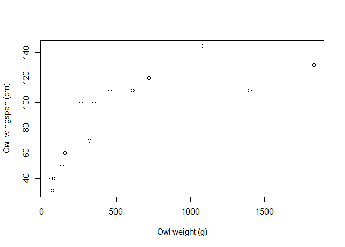<!-- -->

``` r
setwd("G:/My Drive/Programming/Data Science/DATA SETS")
owl_clutch <- read.csv("owl.clutch.size.csv", header = TRUE)
View(owl_clutch)
any(is.na(owl_clutch))
```

    ## [1] FALSE

Since the two datasets have the same contents in row 1 (common.name)
orderly arranged, they can be combined using the cbind function:

``` r
owl_morph_clutch <- cbind(owl_morph, owl_clutch)
View(owl_morph_clutch)
```

NB: The combination syntax above leads to duplication of the “common
name row”. This can be avoided:

``` r
owl_morph_clutch <- cbind(owl_morph, owl_clutch[, 2]) # only the row 2 of the second data is called upon for the combination
```

``` r
names(owl_morph_clutch)[6] <- "clutch.size" # renames the newly added column
```

``` r
plot(owl_morph_clutch$wingspan.cm, owl_morph_clutch$clutch.size,
     xlab = "Owl wing span (cm)", ylab = "Owl clutch size (??)")
```

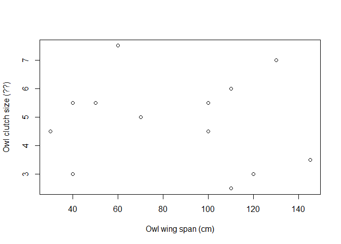<!-- -->

``` r
setwd("G:/My Drive/Programming/Data Science/DATA SETS")
owl_lspan <- read.csv("owl.lifespan.csv", header = TRUE)
View(owl_lspan)
any(is.na(owl_lspan))
```

    ## [1] TRUE

This new data has one NA, and the identifying row (common.name) is not
arranged alphabetically. To combine it with the recent combined data,
use the merge() function and specify the column to be used for
combination

``` r
owl_morph_clutch_life <- merge(owl_morph_clutch, owl_lspan, key = "common.name")
View(owl_morph_clutch_life)
```

# **PART 2**

## The apply() Family of Functions

### 1. apply()

It has the general structure: apply(object, margin, function…); the
object is usually a matrix or an array.  
Consider the ffg example:

``` r
duckweed_mat <- matrix(c(10, 20, 30, 40, 50, 60, 70, 80, 90, 100, 10, 30, 50, 80, 100, 150, 200,
                         250, 270, 300, 10, 30, 36, 80, 96, 106, 110, 130, 136, 144, 10, 15, 30,
                         50, 70, 86, 95, 100, 105, 190, 10, 40, 50, 65, 78, 96, 107, 120, 144,
                         157, 10, 30, 57, 98, 106, 130, 160, 177, 189, 198),
                       nrow = 10, byrow = FALSE)
rownames(duckweed_mat) <- c("Day1", "Day2", "Day3", "Day4", "Day5", "Day6", "Day7", 
                            "Day8", "Day9", "Day10")

colnames(duckweed_mat) <- c("R1", "R2", "R3", "R4", "R5", "R6")
duckweed_mat
```

    ##        R1  R2  R3  R4  R5  R6
    ## Day1   10  10  10  10  10  10
    ## Day2   20  30  30  15  40  30
    ## Day3   30  50  36  30  50  57
    ## Day4   40  80  80  50  65  98
    ## Day5   50 100  96  70  78 106
    ## Day6   60 150 106  86  96 130
    ## Day7   70 200 110  95 107 160
    ## Day8   80 250 130 100 120 177
    ## Day9   90 270 136 105 144 189
    ## Day10 100 300 144 190 157 198

``` r
class(duckweed_mat)
```

    ## [1] "matrix" "array"

Say we want to check the maximum number of leaves recorded each day,
i,e, per row:

``` r
max(duckweed_mat[1,])
```

    ## [1] 10

``` r
max(duckweed_mat[2,])
```

    ## [1] 40

``` r
max(duckweed_mat[3,])
```

    ## [1] 57

…and so on.  
Alternatively, one could use a FOR loop:

``` r
for (i in 1:10) {
  row <- duckweed_mat[i, ]
  max <- max(row)
  print(max)
}
```

    ## [1] 10
    ## [1] 40
    ## [1] 57
    ## [1] 98
    ## [1] 106
    ## [1] 150
    ## [1] 200
    ## [1] 250
    ## [1] 270
    ## [1] 300

All this is done better with the apply() function:

``` r
apply(duckweed_mat, 1, max) # returns the maximum value in each row
```

    ##  Day1  Day2  Day3  Day4  Day5  Day6  Day7  Day8  Day9 Day10 
    ##    10    40    57    98   106   150   200   250   270   300

``` r
#NB: the 2nd argument is the margin -- 1 represents row; 2 implies column
```

Could do the same column-wise

``` r
apply(duckweed_mat, 2, max)
```

    ##  R1  R2  R3  R4  R5  R6 
    ## 100 300 144 190 157 198

``` r
# this prints out the maximum value in each column
```

The apply() function also works for data frames:

``` r
duckweed_df <- data.frame(R1 = c(10, 20, 30, 40, 50, 60, 70, 80, 90, 100),
                          R2 = c(10, 30, 50, 80, 100, 150, 200, 250, 270, 300),
                          R3 = c(10, 30, 36, 80, 96, 106, 110, 130, 136, 144),
                          R4 = c(10, 15, 30, 50, 70, 86, 95, 100, 105, 190),
                          R5 = c(10, 40, 50, 65, 78, 96, 107, 120, 144, 157),
                          R6 = c(10, 30, 57, 98, 106, 130, 160, 177, 189, 198))
class(duckweed_df)
```

    ## [1] "data.frame"

To calculate the means by row

``` r
rowMeans(duckweed_df)
```

    ##  [1]  10.00000  27.50000  42.16667  68.83333  83.33333 104.66667 123.66667
    ##  [8] 142.83333 155.66667 181.50000

Using the apply() function:

``` r
apply(duckweed_df, 1, mean)
```

    ##  [1]  10.00000  27.50000  42.16667  68.83333  83.33333 104.66667 123.66667
    ##  [8] 142.83333 155.66667 181.50000

However, unlike matrices and arrays, a data frame can contain
non-numeric elements:

``` r
duckweed_df$Day <- as.factor(1:10)
(duckweed_df)
```

    ##     R1  R2  R3  R4  R5  R6 Day
    ## 1   10  10  10  10  10  10   1
    ## 2   20  30  30  15  40  30   2
    ## 3   30  50  36  30  50  57   3
    ## 4   40  80  80  50  65  98   4
    ## 5   50 100  96  70  78 106   5
    ## 6   60 150 106  86  96 130   6
    ## 7   70 200 110  95 107 160   7
    ## 8   80 250 130 100 120 177   8
    ## 9   90 270 136 105 144 189   9
    ## 10 100 300 144 190 157 198  10

NB: although the newly added column contains values 1 to 10, these
values have been assigned as non-numeric (factor)

``` r
duckweed_df <- duckweed_df[, c(7, 1:6)] # rearranges the data so that the new column comes 1st
class(duckweed_df$Day) # check that the column is correctly identified as factor 
```

    ## [1] "factor"

Now using the apply function again:

``` r
apply(duckweed_df, 1, mean)
```

    ## Warning in mean.default(newX[, i], ...): argument is not numeric or logical:
    ## returning NA

    ## Warning in mean.default(newX[, i], ...): argument is not numeric or logical:
    ## returning NA

    ## Warning in mean.default(newX[, i], ...): argument is not numeric or logical:
    ## returning NA

    ## Warning in mean.default(newX[, i], ...): argument is not numeric or logical:
    ## returning NA

    ## Warning in mean.default(newX[, i], ...): argument is not numeric or logical:
    ## returning NA

    ## Warning in mean.default(newX[, i], ...): argument is not numeric or logical:
    ## returning NA

    ## Warning in mean.default(newX[, i], ...): argument is not numeric or logical:
    ## returning NA

    ## Warning in mean.default(newX[, i], ...): argument is not numeric or logical:
    ## returning NA

    ## Warning in mean.default(newX[, i], ...): argument is not numeric or logical:
    ## returning NA

    ## Warning in mean.default(newX[, i], ...): argument is not numeric or logical:
    ## returning NA

    ##  [1] NA NA NA NA NA NA NA NA NA NA

NB: the above returns an error message (“Warning: argument is not
numeric or logical: returning NA”) because each row now has a factor, a
data type that is not receptive to arithmetic operations.

``` r
apply(duckweed_df[, 2:7], 1, mean) # the non-numeric column is now excluded
```

    ##  [1]  10.00000  27.50000  42.16667  68.83333  83.33333 104.66667 123.66667
    ##  [8] 142.83333 155.66667 181.50000

``` r
apply(duckweed_df[, -1], 1, mean) # can also be excluded this way
```

    ##  [1]  10.00000  27.50000  42.16667  68.83333  83.33333 104.66667 123.66667
    ##  [8] 142.83333 155.66667 181.50000

``` r
apply(duckweed_df[, -c(1,2,4,6)], 1, mean) # can also exclude several columns
```

    ##  [1]  10.00000  25.00000  45.66667  76.00000  92.00000 122.00000 151.66667
    ##  [8] 175.66667 188.00000 229.33333

Throw a missing observation into the mix:

``` r
duckweed_df[6, 5] <- NA
(duckweed_df)
```

    ##    Day  R1  R2  R3  R4  R5  R6
    ## 1    1  10  10  10  10  10  10
    ## 2    2  20  30  30  15  40  30
    ## 3    3  30  50  36  30  50  57
    ## 4    4  40  80  80  50  65  98
    ## 5    5  50 100  96  70  78 106
    ## 6    6  60 150 106  NA  96 130
    ## 7    7  70 200 110  95 107 160
    ## 8    8  80 250 130 100 120 177
    ## 9    9  90 270 136 105 144 189
    ## 10  10 100 300 144 190 157 198

``` r
apply(duckweed_df[, -1], 1, mean)
```

    ##  [1]  10.00000  27.50000  42.16667  68.83333  83.33333        NA 123.66667
    ##  [8] 142.83333 155.66667 181.50000

NB: Now that there is a missing value in a row, that row returns a mean
of “NA”. If that specific cell is not of interest, one could instruct R
to ignore it and compute the mean for only the non-missing values in
that row:

``` r
apply(duckweed_df[, -1], 1, mean, na.rm = TRUE) # na.rm "removes" the missing value(s) from the calculation
```

    ##  [1]  10.00000  27.50000  42.16667  68.83333  83.33333 108.40000 123.66667
    ##  [8] 142.83333 155.66667 181.50000

#### Using customized functions

The examples thus far have used a built-in R function (i.e., mean). But
customized functions can also be used. For example, one may be
interested in calculating, for each plant, the no. of leaves counted
each day as a proportion of the total no. of leaves (i.e, the count on
the 10th day) for that plant:

``` r
prop <- function(x) {
  x / max(x)
}
```

Using the matrix data:

``` r
(duckweed_mat)
```

    ##        R1  R2  R3  R4  R5  R6
    ## Day1   10  10  10  10  10  10
    ## Day2   20  30  30  15  40  30
    ## Day3   30  50  36  30  50  57
    ## Day4   40  80  80  50  65  98
    ## Day5   50 100  96  70  78 106
    ## Day6   60 150 106  86  96 130
    ## Day7   70 200 110  95 107 160
    ## Day8   80 250 130 100 120 177
    ## Day9   90 270 136 105 144 189
    ## Day10 100 300 144 190 157 198

``` r
apply(duckweed_mat, 2, prop)
```

    ##        R1         R2         R3         R4         R5         R6
    ## Day1  0.1 0.03333333 0.06944444 0.05263158 0.06369427 0.05050505
    ## Day2  0.2 0.10000000 0.20833333 0.07894737 0.25477707 0.15151515
    ## Day3  0.3 0.16666667 0.25000000 0.15789474 0.31847134 0.28787879
    ## Day4  0.4 0.26666667 0.55555556 0.26315789 0.41401274 0.49494949
    ## Day5  0.5 0.33333333 0.66666667 0.36842105 0.49681529 0.53535354
    ## Day6  0.6 0.50000000 0.73611111 0.45263158 0.61146497 0.65656566
    ## Day7  0.7 0.66666667 0.76388889 0.50000000 0.68152866 0.80808081
    ## Day8  0.8 0.83333333 0.90277778 0.52631579 0.76433121 0.89393939
    ## Day9  0.9 0.90000000 0.94444444 0.55263158 0.91719745 0.95454545
    ## Day10 1.0 1.00000000 1.00000000 1.00000000 1.00000000 1.00000000

Note that the calculation is per column, hence the margin argument is
set to “2”.  
Basically, the apply() function takes each column as a vector and each
cell as an element in that vector.

### 2. lapply()

General structure: lapply(object, function, …)  
-\> the “object” could be vector, list, or data frame.  
-\> lapply() returns only list outputs.  
Example - Below is an hypothetical data on the clutch sizes of Canada
geese under 4 different diet regimes, with 10 replicates in each diet
group:

``` r
cago_list <- list(Diet1 = c(2, 5, 4, 5, 3, 5, 4, 4, 4, 5),
                  Diet2 = c(8, 5, 6, 5, 7, 7, 6, 8, 8, 3),
                  Diet3 = c(3, 4, 2, 5, 2, 6, 5, 6, 2, 4),
                  Diet4 = c(2, 2, 3, 2, 5, 2, 4, 3, 5, 7))
class(cago_list)
```

    ## [1] "list"

``` r
(cago_list)
```

    ## $Diet1
    ##  [1] 2 5 4 5 3 5 4 4 4 5
    ## 
    ## $Diet2
    ##  [1] 8 5 6 5 7 7 6 8 8 3
    ## 
    ## $Diet3
    ##  [1] 3 4 2 5 2 6 5 6 2 4
    ## 
    ## $Diet4
    ##  [1] 2 2 3 2 5 2 4 3 5 7

Use the lapply() function on the data:

``` r
lapply(cago_list, mean)
```

    ## $Diet1
    ## [1] 4.1
    ## 
    ## $Diet2
    ## [1] 6.3
    ## 
    ## $Diet3
    ## [1] 3.9
    ## 
    ## $Diet4
    ## [1] 3.5

NB: each row is a vector, and the mean is thus returned per vector
(i.e., diet).

The same data could be stored in a data frame instead:

``` r
cago_df <- data.frame(Diet1 = c(2, 5, 4, 5, 3, 5, 4, 4, 4, 5),
                  Diet2 = c(8, 5, 6, 5, 7, 7, 6, 8, 8, 3),
                  Diet3 = c(3, 4, 2, 5, 2, 6, 5, 6, 2, 4),
                  Diet4 = c(2, 2, 3, 2, 5, 2, 4, 3, 5, 7))
lapply(cago_df, mean)
```

    ## $Diet1
    ## [1] 4.1
    ## 
    ## $Diet2
    ## [1] 6.3
    ## 
    ## $Diet3
    ## [1] 3.9
    ## 
    ## $Diet4
    ## [1] 3.5

Again, using the lapply returns the output in a list format. There is
also no margin argument, unlike apply().  

A vector example:

``` r
random <- c("This", "is", "a", "random", "vector")
```

The no. of letters in each of the words contained in the vector can be
determined as follows:

``` r
lapply(random, nchar)
```

    ## [[1]]
    ## [1] 4
    ## 
    ## [[2]]
    ## [1] 2
    ## 
    ## [[3]]
    ## [1] 1
    ## 
    ## [[4]]
    ## [1] 6
    ## 
    ## [[5]]
    ## [1] 6

NB – unlike the lapply() function, the following syntax returns an
output in a vector format:

``` r
nchar(random)
```

    ## [1] 4 2 1 6 6

### 3. sapply()

–\> It has the same general structure as lapply() and also applies to
lists, vectors, and data frames. However, outputs are returned in a
simplified format if possible (vector, matrix, or list). In addition, as
in lapply(), sapply() has no margin argument.

``` r
cago_list
```

    ## $Diet1
    ##  [1] 2 5 4 5 3 5 4 4 4 5
    ## 
    ## $Diet2
    ##  [1] 8 5 6 5 7 7 6 8 8 3
    ## 
    ## $Diet3
    ##  [1] 3 4 2 5 2 6 5 6 2 4
    ## 
    ## $Diet4
    ##  [1] 2 2 3 2 5 2 4 3 5 7

``` r
sapply(cago_list, mean) # results are in a vector format
```

    ## Diet1 Diet2 Diet3 Diet4 
    ##   4.1   6.3   3.9   3.5

``` r
cago_df
```

    ##    Diet1 Diet2 Diet3 Diet4
    ## 1      2     8     3     2
    ## 2      5     5     4     2
    ## 3      4     6     2     3
    ## 4      5     5     5     2
    ## 5      3     7     2     5
    ## 6      5     7     6     2
    ## 7      4     6     5     4
    ## 8      4     8     6     3
    ## 9      4     8     2     5
    ## 10     5     3     4     7

``` r
sapply(cago_df, mean) # results also in vector format
```

    ## Diet1 Diet2 Diet3 Diet4 
    ##   4.1   6.3   3.9   3.5

``` r
random
```

    ## [1] "This"   "is"     "a"      "random" "vector"

``` r
sapply(random, nchar)
```

    ##   This     is      a random vector 
    ##      4      2      1      6      6

Sometimes, the output could not be simplified to a vector or matrix:

``` r
sequence <- function(x) {
  seq(nchar(x))
}
```

As a reminder, the seq() function returns a sequence from 1 to number of
specified element. See ffg examples:

``` r
seq(3) # this outputs "1 2 3"
```

    ## [1] 1 2 3

``` r
seq(nchar("that")) #this outputs "1 2 3 4"
```

    ## [1] 1 2 3 4

Now, apply the created function above

``` r
sapply(random, sequence)
```

    ## $This
    ## [1] 1 2 3 4
    ## 
    ## $is
    ## [1] 1 2
    ## 
    ## $a
    ## [1] 1
    ## 
    ## $random
    ## [1] 1 2 3 4 5 6
    ## 
    ## $vector
    ## [1] 1 2 3 4 5 6

As displayed, the output is not simplified as vector.

### 4. tapply()

General structure: tapply(x, index, function, …)  
–\> It applies to object subsets (vector, column of a data frame,
element of a list, etc…)

``` r
patient_ID <- 1:30
age <- c(32, 45, 44, 34, 23, 26, 37, 45, 12, 23, 44, 35, 57, 65, 76, 43, 42, 34,
         36, 37, 23, 21, 28, 24, 29, 13, 18, 32, 25, 28)
treatment <- c("a", "c", "c", "b", "b", "b", "c", "b", "c", "a", "a", "a", "a", "a","b",
               "b", "b", "b", "c", "c", "c", "a", "b", "c", "b", "a", "a", "c", "a", "c")
```

``` r
tapply(age, treatment, mean) # gives the mean age by treatment groups
```

    ##    a    b    c 
    ## 33.3 38.0 31.8

Store the data in a data frame, and apply the function:

``` r
med_df <- data.frame(patient_ID, treatment, age)
head(med_df) # Recall: 6 rows by default (same as the tail fxn)
```

    ##   patient_ID treatment age
    ## 1          1         a  32
    ## 2          2         c  45
    ## 3          3         c  44
    ## 4          4         b  34
    ## 5          5         b  23
    ## 6          6         b  26

``` r
tapply(med_df$age, med_df$treatment, mean)
```

    ##    a    b    c 
    ## 33.3 38.0 31.8

A list could also work:

``` r
med_list <- list(patient_ID = patient_ID, treatment = treatment, age = age)
tapply(med_list$age, med_list$treatment, mean)
```

    ##    a    b    c 
    ## 33.3 38.0 31.8

# **PART 3**

## aggregate() function

–\> Similar to tapply() but with wider applications  
–\> General structure: aggregate(formula, data, function, …)  
–\> works with list or data frame (other data structures will be
converted to either of these two)

Example – Using the co2_uptake data (a built-in data set in R that
contains an experiment data of CO2 uptake in plants from two different
locations):

``` r
co2_uptake <- CO2
head(co2_uptake)
```

    ##   Plant   Type  Treatment conc uptake
    ## 1   Qn1 Quebec nonchilled   95   16.0
    ## 2   Qn1 Quebec nonchilled  175   30.4
    ## 3   Qn1 Quebec nonchilled  250   34.8
    ## 4   Qn1 Quebec nonchilled  350   37.2
    ## 5   Qn1 Quebec nonchilled  500   35.3
    ## 6   Qn1 Quebec nonchilled  675   39.2

Add a new column to the data:

``` r
co2_uptake$height <- c(35.77, 43.95, 38.10, 43.20, 43.02, 39.19, 31.60, 36.88, 41.11, 43.64,
                       36.82, 33.86, 30.17, 36.92, 36.15, 43.60, 32.35, 43.92, 40.50, 37.46, 
                       33.92, 42.19, 30.20, 35.64, 39.63, 36.39, 42.95, 33.88, 43.75, 41.10, 
                       34.57, 30.21, 37.19, 33.45, 40.93, 32.93, 36.21, 40.74, 32.87, 35.98,
                       43.57, 39.91, 35.02, 33.20, 37.89, 34.96, 30.99, 40.12, 33.33, 34.48,
                       38.22, 35.21, 39.60, 40.29, 42.90, 36.09, 38.75, 36.65, 31.51, 39.32, 
                       30.27, 34.21, 40.59, 43.67, 32.10, 30.08, 42.10, 36.60, 43.89, 38.33,
                       36.99, 32.05, 37.54, 34.51, 33.69, 41.80, 30.91, 39.23, 30.93, 42.73,
                       34.82, 33.20, 31.57, 43.32)

View(co2_uptake)
```

There are 7 concentration categories (95,175,250,350,500,675,1000) in
the data. To calculate, say, mean uptake for each conc category:

``` r
aggregate(uptake~conc, co2_uptake, mean) # tabular output
```

    ##   conc   uptake
    ## 1   95 12.25833
    ## 2  175 22.28333
    ## 3  250 28.87500
    ## 4  350 30.66667
    ## 5  500 30.87500
    ## 6  675 31.95000
    ## 7 1000 33.58333

As already mentioned, the same operation could be performed using
tapply(), but the output is in a vector format (unlike the aggregate fxn
which produced a tabular output):

``` r
tapply(co2_uptake$uptake, co2_uptake$conc, mean) # vector output
```

    ##       95      175      250      350      500      675     1000 
    ## 12.25833 22.28333 28.87500 30.66667 30.87500 31.95000 33.58333

Even better, aggregate() can handle multiple subsetting. For example, to
calculate the mean uptake by concentration category and treatment group:

``` r
aggregate(uptake ~ conc + Treatment, co2_uptake, mean)
```

    ##    conc  Treatment   uptake
    ## 1    95 nonchilled 13.28333
    ## 2   175 nonchilled 25.11667
    ## 3   250 nonchilled 32.46667
    ## 4   350 nonchilled 35.13333
    ## 5   500 nonchilled 35.10000
    ## 6   675 nonchilled 36.01667
    ## 7  1000 nonchilled 37.38333
    ## 8    95    chilled 11.23333
    ## 9   175    chilled 19.45000
    ## 10  250    chilled 25.28333
    ## 11  350    chilled 26.20000
    ## 12  500    chilled 26.65000
    ## 13  675    chilled 27.88333
    ## 14 1000    chilled 29.78333

…or, mean uptake by conc, treatment, and type:

``` r
aggregate(uptake ~ conc + Treatment + Type, co2_uptake, mean)
```

    ##    conc  Treatment        Type   uptake
    ## 1    95 nonchilled      Quebec 15.26667
    ## 2   175 nonchilled      Quebec 30.03333
    ## 3   250 nonchilled      Quebec 37.40000
    ## 4   350 nonchilled      Quebec 40.36667
    ## 5   500 nonchilled      Quebec 39.60000
    ## 6   675 nonchilled      Quebec 41.50000
    ## 7  1000 nonchilled      Quebec 43.16667
    ## 8    95    chilled      Quebec 12.86667
    ## 9   175    chilled      Quebec 24.13333
    ## 10  250    chilled      Quebec 34.46667
    ## 11  350    chilled      Quebec 35.80000
    ## 12  500    chilled      Quebec 36.66667
    ## 13  675    chilled      Quebec 37.50000
    ## 14 1000    chilled      Quebec 40.83333
    ## 15   95 nonchilled Mississippi 11.30000
    ## 16  175 nonchilled Mississippi 20.20000
    ## 17  250 nonchilled Mississippi 27.53333
    ## 18  350 nonchilled Mississippi 29.90000
    ## 19  500 nonchilled Mississippi 30.60000
    ## 20  675 nonchilled Mississippi 30.53333
    ## 21 1000 nonchilled Mississippi 31.60000
    ## 22   95    chilled Mississippi  9.60000
    ## 23  175    chilled Mississippi 14.76667
    ## 24  250    chilled Mississippi 16.10000
    ## 25  350    chilled Mississippi 16.60000
    ## 26  500    chilled Mississippi 16.63333
    ## 27  675    chilled Mississippi 18.26667
    ## 28 1000    chilled Mississippi 18.73333

Operations can also be performed on multiple elements/columns. For
example, to calculate the mean uptake and mean height by conc:

``` r
aggregate(cbind(uptake, height) ~ conc, co2_uptake, mean)
```

    ##   conc   uptake   height
    ## 1   95 12.25833 37.98417
    ## 2  175 22.28333 36.61000
    ## 3  250 28.87500 36.66667
    ## 4  350 30.66667 37.66333
    ## 5  500 30.87500 35.99833
    ## 6  675 31.95000 38.44000
    ## 7 1000 33.58333 36.64417

aggregate() also works on lists:

``` r
co2uptake_list <- list(plant = co2_uptake$Plant, type = co2_uptake$Type, 
                       treatment = co2_uptake$Treatment, conc = co2_uptake$conc, 
                       uptake = co2_uptake$uptake, height = co2_uptake$height)
```

``` r
aggregate(cbind(uptake, height) ~ conc, co2uptake_list, mean)
```

    ##   conc   uptake   height
    ## 1   95 12.25833 37.98417
    ## 2  175 22.28333 36.61000
    ## 3  250 28.87500 36.66667
    ## 4  350 30.66667 37.66333
    ## 5  500 30.87500 35.99833
    ## 6  675 31.95000 38.44000
    ## 7 1000 33.58333 36.64417

NB: the output structure is the same as for data frame.  

Other functions can also be applied using aggregate(). For example:

``` r
aggregate(uptake ~ conc, co2uptake_list, length) # no. of uptake values recorded for each conc group
```

    ##   conc uptake
    ## 1   95     12
    ## 2  175     12
    ## 3  250     12
    ## 4  350     12
    ## 5  500     12
    ## 6  675     12
    ## 7 1000     12

``` r
aggregate(height ~ conc, co2uptake_list, length) # no. of height values per conc group
```

    ##   conc height
    ## 1   95     12
    ## 2  175     12
    ## 3  250     12
    ## 4  350     12
    ## 5  500     12
    ## 6  675     12
    ## 7 1000     12

``` r
aggregate(type ~ conc, co2uptake_list, length) # no. of type values per conc group
```

    ##   conc type
    ## 1   95   12
    ## 2  175   12
    ## 3  250   12
    ## 4  350   12
    ## 5  500   12
    ## 6  675   12
    ## 7 1000   12

## paste() function

This function allows to merge multiple elements together as one. For
example, working with a sample of birds, one could assign each
individual a label containing their name and ID:

``` r
paste("RWBL", 1)
```

    ## [1] "RWBL 1"

Alternatively, the entries can be first stored before calling the
paste() function:

``` r
species <- "RWBL"
num <- 1
paste(species, num)
```

    ## [1] "RWBL 1"

A “sep” argument can be added to define the separator (default is
space):

``` r
paste(species, num, sep = "-")
```

    ## [1] "RWBL-1"

When paste() is used on a vector containing several elements, it doesn’t
work (i.e., each element in that vector maintains its independence),
unless the “collapse” argument is properly invoked/defined:

``` r
id <- c("RWBL", 1)
paste(id) # each element in "id" is pasted separately
```

    ## [1] "RWBL" "1"

``` r
paste(id, collapse = " ") # default value for collapse is NULL
```

    ## [1] "RWBL 1"

``` r
# the paste function now works as expected
```

``` r
paste(id, collapse = "_")
```

    ## [1] "RWBL_1"

NB: the “collapse” argument works like the “sep” argument; so it could
take different values like space, underscore, period, etc. The default
value is NULL.  

The paste() function is really powerful when used with several vectors:

``` r
species <- c("RWBL", "MODO", "AMRO", "AMCR", "MODO")
num <- 1:5
paste(species, num, sep = "_")
```

    ## [1] "RWBL_1" "MODO_2" "AMRO_3" "AMCR_4" "MODO_5"

It the pasted vectors are of different length, the longer one starts
recycling with the rest, E.g.:

``` r
species <- c("RWBL", "MODO", "AMRO", "AMCR", "MODO")
num <- 1:8
paste(species, num, sep = "_")
```

    ## [1] "RWBL_1" "MODO_2" "AMRO_3" "AMCR_4" "MODO_5" "RWBL_6" "MODO_7" "AMRO_8"

This “recycling” feature comes in handy in the case of repetitions:

``` r
num <- 1:10
paste("Bird", num) # the "Bird" element gets recycled through the num var, thus printing Bird 1, Bird 2, ... Bird 10.
```

    ##  [1] "Bird 1"  "Bird 2"  "Bird 3"  "Bird 4"  "Bird 5"  "Bird 6"  "Bird 7" 
    ##  [8] "Bird 8"  "Bird 9"  "Bird 10"

Data frame application:

``` r
df <- data.frame(species, num = 1:5)
paste(df$species, df$num, sep = "_") # as usual, the output is vector
```

    ## [1] "RWBL_1" "MODO_2" "AMRO_3" "AMCR_4" "MODO_5"

The output of the paste() function can be saved in an object and put to
further use:

``` r
output = paste(df$species, df$num, sep = "_")
df$idnum = output
```

``` r
View(df)
```

# **PART 4**

## Basic Plotting

``` r
maxd <- 10
storks <- numeric(maxd)
babies <- numeric(maxd)
set.seed(15) # to retain the results of the rnorm functions
for (i in 1:maxd) {
  storks[i] <- rnorm(1, i * 100, 10) # Recall -- general form is rnorm(n, mean, sd)
  babies[i] <- rnorm(1, i * 10, 10)
}
```

``` r
(storks)
```

    ##  [1] 102.5882 196.6038 304.8802 400.2279 498.6788 608.5501 701.6555 814.5929
    ##  [9] 899.7912 988.3272

``` r
(babies)
```

    ##  [1] 28.31121 28.97198 17.44614 50.90773 39.24999 56.35020 57.57215 79.96387
    ##  [9] 90.32106 94.80428

``` r
plot(storks, babies)
abline(lm(babies ~ storks)) # fits a regression line to the plot

# let's plot a new graph on the existing plot: 
newstorkdata <- c(220, 411, 630, 705, 729, 850)
newbabydata <- c(11, 22, 38, 41, 45, 52)
points(newstorkdata, newbabydata, col = "red", pch = 19) #plots this on the existing graph; red  here is the color of the new points/observations
abline(lm(newbabydata ~ newstorkdata), col = "red") # red here is the color of the new line

# add a legend to the graph:
legend(100, 90, c("old data", "new data"), pch = c(1, 19), col = c("black", "red"))
```

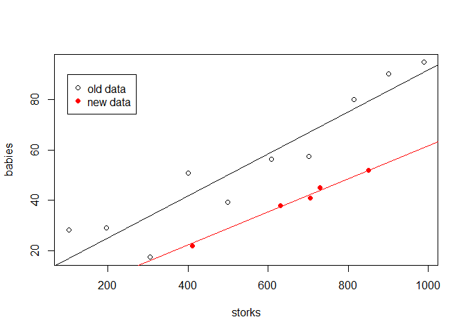<!-- -->

``` r
# NB: The first argument for the legend function is "x,y". Here, the value is 100,90, i.e., the legend should be placed at the point on the graph where x=100 and y=90
```

NB: using the locator function (as shown in the following code) works in
basic R script, but not in R markdown:  
*legend(locator(1), c(“old data”, “new data”), pch = c(1, 19), col =
c(“black”, “red”))*

One could also split the plot area as follows:

``` r
par(mfrow= c(1, 2)) # splits the plot area into a row with 2 columns
# Recall that this code does not affect subsequent code chunks. However, in R scripts, the plot area must be reset to return to the original, non-split type, i.e., by running the code: par(mfrow = c(1,1))
```

The par() function can also be used to further define certain attributes
of the graph(s), e.g.,:  
par(las = 1, cex = 1, cex.lab =1.2, cex.axis = 1.1)  
\>– las defines the style of axis labels (0=default=parallel,
1=horizontal, …)  
\>– cex magnifies plotting texts and symbols relative to the current
size  
\>– cex.lab magnifies axis labels relative to the current size  
\>– cex.axis magnifies axis annotations relative to the current size

## Creating box plots using R’s ggplot2 package

``` r
mydata <- ToothGrowth # ToothGrowth is a built-in data set in R
mydata$dose <- as.factor(mydata$dose) #changes the dose var to factor data type
View(mydata)
```

``` r
# install.packages("tidyverse") 
library("ggplot2")
```

    ## Warning: package 'ggplot2' was built under R version 4.3.2

``` r
names(mydata)
```

    ## [1] "len"  "supp" "dose"

Now, let’s create a box plot:

``` r
ggplot(mydata, aes(supp, len)) # creates an empty plot 
```

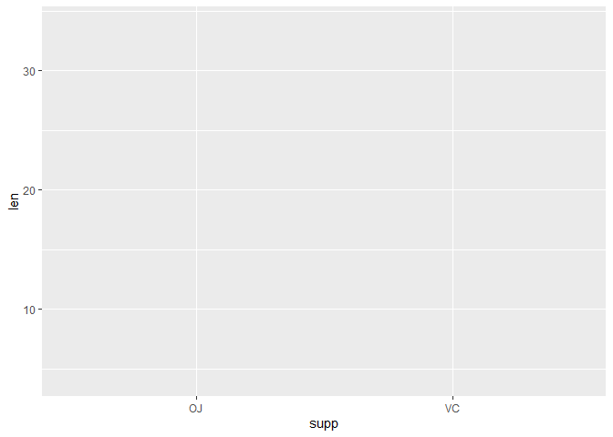<!-- -->

``` r
ggplot(mydata, aes(supp, len)) + geom_boxplot() # inserts a boxplot into the empty plot created above
```

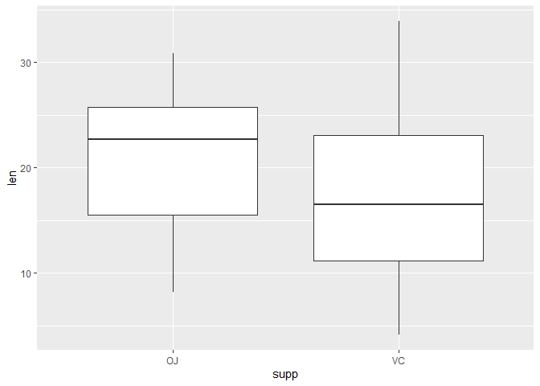<!-- -->

``` r
# differentiate columns of box plots by the dose category
ggplot(mydata, aes(supp, len)) + geom_boxplot() + facet_grid(. ~ dose)
```

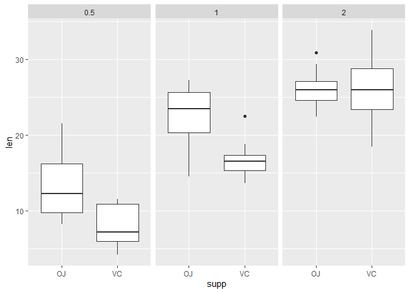<!-- -->

Alternatively, this “subsetting” can be done in the aesthetic (“aes”)
argument:

``` r
ggplot(mydata, aes(supp, len, fill = dose)) + geom_boxplot() # this creates all box plots on a single graph, each category's plot differentiated by a distinct color.
```

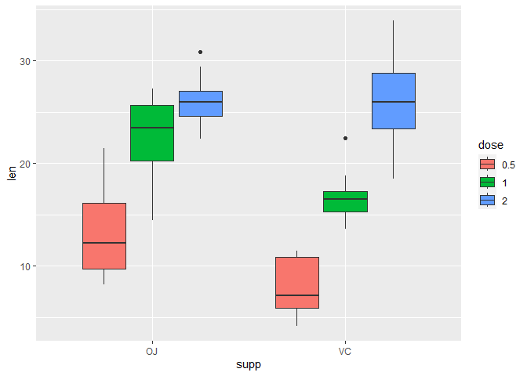<!-- -->

Further, the color can be set such that darker/lighter color indicates
an increase or decrease in levels of, for example, dose:

``` r
my_color <- c("#fff7bc", "#fec44f", "#d95f0e") # yellow, orange, and red colors, respectively
ggplot(mydata, aes(supp, len, fill = dose)) + geom_boxplot() + scale_fill_manual(
                                    name = "Dose (mm)", breaks = c("0.5", "1", "2"),
                                   labels = c("Low 0.5mm", "Medium 1mm", "High 2mm"),
                                   values = my_color)
```

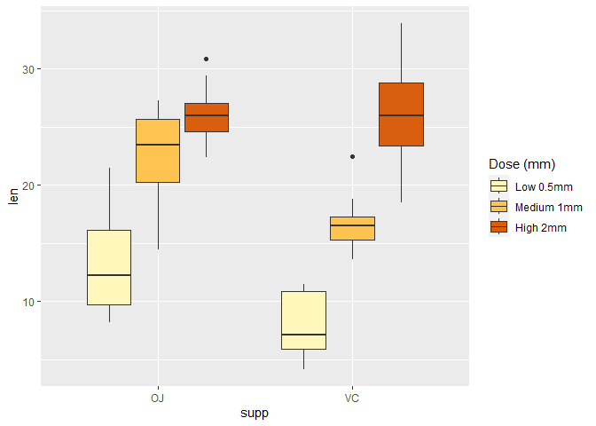<!-- -->

Change the background color to black and white:

``` r
ggplot(mydata, aes(supp, len, fill = dose)) + geom_boxplot() + scale_fill_manual(
  name = "Dose (mm)", breaks = c("0.5", "1", "2"),
  labels = c("Low 0.5mm", "Medium 1mm", "High 2mm"),
  values = my_color) + theme_bw() # NB: the previous color was grey-ish
```

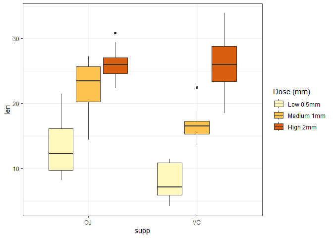<!-- -->

And a lot more…

``` r
ggplot(mydata, aes(supp, len, fill = dose)) + geom_boxplot() + scale_fill_manual(
  name = "Dose (mm)", breaks = c("0.5", "1", "2"),
  labels = c("Low 0.5mm", "Medium 1mm", "High 2mm"),
  values = my_color) + theme(plot.background = element_blank(),
                             panel.grid.major = element_blank(),
                             panel.grid.minor = element_blank(),
                             panel.background = element_blank(),
                             axis.line = element_line(colour = "black"),
                             axis.title.x = element_text(size = 19, colour = "black"),
                             axis.title.y = element_text(size = 19, colour = "black"),
                             axis.text.x = element_text(size = 12, colour = "black"),
                             axis.text.y = element_text(size = 12, colour = "black"),
                             legend.text = element_text(size = 12),
                             legend.title = element_text(size = 15),
                             legend.background = element_rect(color = "black", 
                                                              size = .5,
                                                              linetype = "solid"),
                             legend.position = c(.60, .85)) + labs(x = "Supplement regimen",
                                                                   y = "Tooth length (mm)")
```

    ## Warning: The `size` argument of `element_rect()` is deprecated as of ggplot2 3.4.0.
    ## ℹ Please use the `linewidth` argument instead.
    ## This warning is displayed once every 8 hours.
    ## Call `lifecycle::last_lifecycle_warnings()` to see where this warning was
    ## generated.

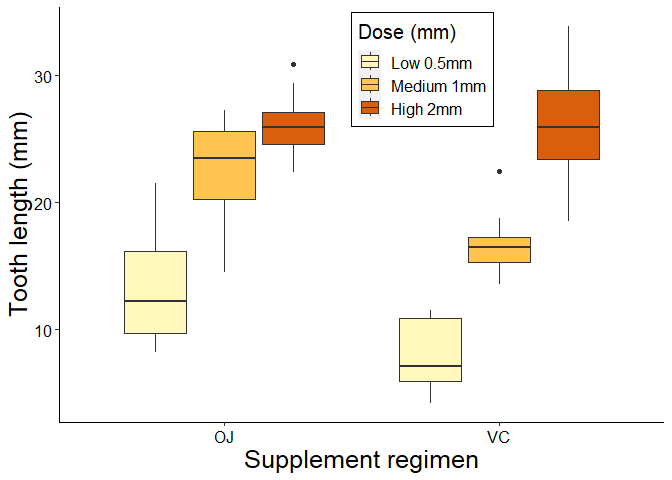<!-- -->

## Creating Histograms and density plots using ggplot2

``` r
setwd("G:/My Drive/Programming/Data Science/DATA SETS")
getwd()
```

    ## [1] "G:/My Drive/Programming/Data Science/DATA SETS"

``` r
mydata <- read.csv("Mammal_lifehistories_v2.csv")
names(mydata)
```

    ##  [1] "order"        "family"       "genus"        "species"      "mass.g"      
    ##  [6] "gestation.mo" "newborn.g"    "weaning.mo"   "wean.mass.g"  "AFR.mo"      
    ## [11] "max.life.mo"  "litter.size"  "litters.year" "refs"

``` r
View(mydata)
head(mydata)
```

    ##          order         family       genus       species mass.g gestation.mo
    ## 1 Artiodactyla Antilocapridae Antilocapra     americana  45375         8.13
    ## 2 Artiodactyla        Bovidae       Addax nasomaculatus 182375         9.39
    ## 3 Artiodactyla        Bovidae   Aepyceros      melampus  41480         6.35
    ## 4 Artiodactyla        Bovidae  Alcelaphus    buselaphus 150000         7.90
    ## 5 Artiodactyla        Bovidae  Ammodorcas       clarkei  28500         6.80
    ## 6 Artiodactyla        Bovidae  Ammotragus        lervia  55500         5.08
    ##   newborn.g weaning.mo wean.mass.g  AFR.mo max.life.mo litter.size litters.year
    ## 1   3246.36       3.00        8900   13.53         142        1.85         1.00
    ## 2   5480.00       6.50        -999   27.27         308        1.00         0.99
    ## 3   5093.00       5.63       15900   16.66         213        1.00         0.95
    ## 4  10166.67       6.50        -999   23.02         240        1.00      -999.00
    ## 5   -999.00    -999.00        -999 -999.00        -999        1.00      -999.00
    ## 6   3810.00       4.00        -999   14.89         251        1.37         2.00
    ##                refs
    ## 1  1,2,6,9,23,26,27
    ## 2      1,2,17,23,26
    ## 3     1,2,8,9,23,29
    ## 4         1,2,17,23
    ## 5               1,2
    ## 6 1,2,9,11,17,23,29

``` r
summary(mydata)
```

    ##     order              family             genus             species         
    ##  Length:1440        Length:1440        Length:1440        Length:1440       
    ##  Class :character   Class :character   Class :character   Class :character  
    ##  Mode  :character   Mode  :character   Mode  :character   Mode  :character  
    ##                                                                             
    ##                                                                             
    ##                                                                             
    ##      mass.g           gestation.mo       newborn.g           weaning.mo     
    ##  Min.   :     -999   Min.   :-999.00   Min.   :   -999.0   Min.   :-999.00  
    ##  1st Qu.:       50   1st Qu.:-999.00   1st Qu.:   -999.0   1st Qu.:-999.00  
    ##  Median :      403   Median :   1.05   Median :      2.6   Median :   0.73  
    ##  Mean   :   383577   Mean   :-287.25   Mean   :   6703.1   Mean   :-427.17  
    ##  3rd Qu.:     7009   3rd Qu.:   4.50   3rd Qu.:     98.0   3rd Qu.:   2.00  
    ##  Max.   :149000000   Max.   :  21.46   Max.   :2250000.0   Max.   :  48.00  
    ##   wean.mass.g           AFR.mo         max.life.mo      litter.size      
    ##  Min.   :    -999   Min.   :-999.00   Min.   :-999.0   Min.   :-999.000  
    ##  1st Qu.:    -999   1st Qu.:-999.00   1st Qu.:-999.0   1st Qu.:   1.000  
    ##  Median :    -999   Median :   2.50   Median :-999.0   Median :   2.270  
    ##  Mean   :   16049   Mean   :-408.12   Mean   :-490.3   Mean   : -55.634  
    ##  3rd Qu.:      10   3rd Qu.:  15.61   3rd Qu.: 147.2   3rd Qu.:   3.835  
    ##  Max.   :19075000   Max.   : 210.00   Max.   :1368.0   Max.   :  14.180  
    ##   litters.year          refs          
    ##  Min.   :-999.000   Length:1440       
    ##  1st Qu.:-999.000   Class :character  
    ##  Median :   0.375   Mode  :character  
    ##  Mean   :-477.141                     
    ##  3rd Qu.:   1.155                     
    ##  Max.   :   7.500

``` r
ncol(mydata)
```

    ## [1] 14

``` r
nrow(mydata)
```

    ## [1] 1440

Some of the cells have “-999” representing NA’s (missing cases); remove
such obs:

``` r
mydata <- mydata[mydata$gestation.mo > 0 & mydata$mass.g > 0 & mydata$litter.size > 0, ]
```

``` r
m <- ggplot(mydata, aes(x = gestation.mo))
m + geom_histogram()
```

    ## `stat_bin()` using `bins = 30`. Pick better value with `binwidth`.

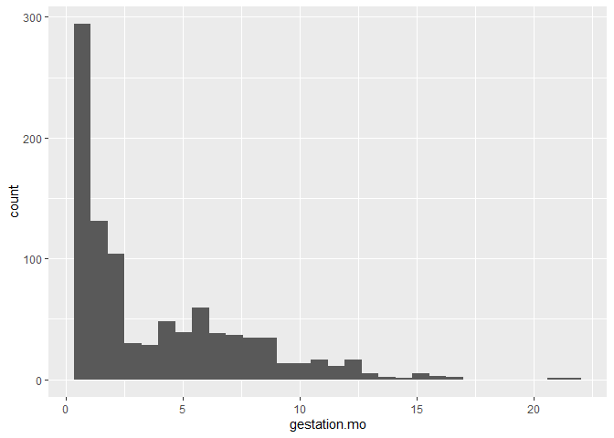<!-- -->

Change the width of the bars:

``` r
m + geom_histogram(binwidth = 0.4)
```

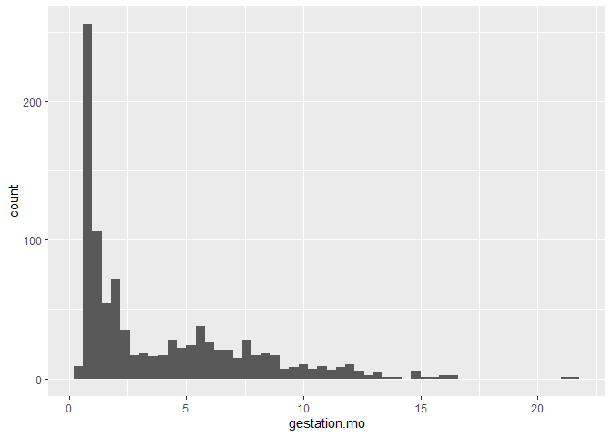<!-- -->

To create different histograms by, say, order categories (1st column in
the current data):

``` r
m + geom_histogram(binwidth = 0.4) + facet_grid(order ~ .)
```

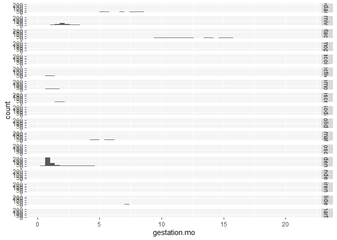<!-- -->
NB: the result is too tiny to read because there are too many order
categories, some well-sampled and others under-sampled.

To get the \# of obs in each order category:

``` r
xtabs(~ order, mydata)
```

    ## order
    ##   Artiodactyla      Carnivora        Cetacea     Dermoptera     Hyracoidea 
    ##            143            170             40              1              4 
    ##    Insectivora     Lagomorpha  Macroscelidea Perissodactyla      Pholidota 
    ##             45             27              6             14              3 
    ##       Primates    Proboscidea       Rodentia     Scandentia        Sirenia 
    ##            113              2            374              3              3 
    ##  Tubulidentata      Xenarthra 
    ##              1             16

Subset orders with enough obs (say at least 100 each):

``` r
mydata_largeorders <- mydata[mydata$order == "Artiodactyla" | mydata$order == "Carnivora" |
                               mydata$order == "Primates" | mydata$order == "Rodentia", ]
```

Now rerun the operation on the subset data:

``` r
m2 <- ggplot(mydata_largeorders, aes(x = gestation.mo))
m2 + geom_histogram(binwidth = 0.7) + facet_grid(order ~ .)
```

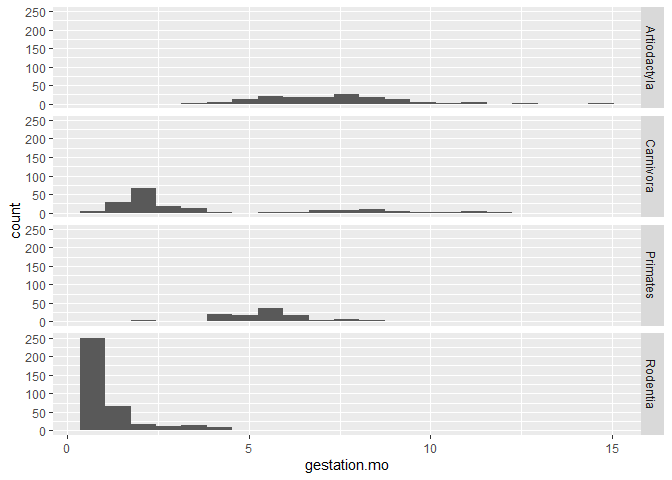<!-- -->

## Creating scatterplots using ggplot2

``` r
setwd("G:/My Drive/Programming/Data Science/DATA SETS")
co2data <- read.csv("canada.co2.by.sector.csv")
names(co2data)
```

    ## [1] "year"               "GEO"                "SECTOR"            
    ## [4] "co2_ann_kilotonnes"

``` r
nrow(co2data); dim(co2data)
```

    ## [1] 2223

    ## [1] 2223    4

``` r
summary(co2data)
```

    ##       year          GEO               SECTOR          co2_ann_kilotonnes
    ##  Min.   :1990   Length:2223        Length:2223        Min.   :     5.0  
    ##  1st Qu.:1994   Class :character   Class :character   1st Qu.:   239.5  
    ##  Median :1999   Mode  :character   Mode  :character   Median :   884.0  
    ##  Mean   :1999                                         Mean   : 16785.0  
    ##  3rd Qu.:2004                                         3rd Qu.:  3353.5  
    ##  Max.   :2008                                         Max.   :723002.0

``` r
View(co2data)
head(co2data)
```

    ##   year    GEO             SECTOR co2_ann_kilotonnes
    ## 1 1990 Canada Total, all sectors             571464
    ## 2 1991 Canada Total, all sectors             558826
    ## 3 1992 Canada Total, all sectors             580145
    ## 4 1993 Canada Total, all sectors             581403
    ## 5 1994 Canada Total, all sectors             601208
    ## 6 1995 Canada Total, all sectors             620353

Remove rows/obs where the sector value is “Total, all sectors”

``` r
co2data <- co2data[co2data$SECTOR != "Total, all sectors", ]
```

Create a scatterplot of output (in kilotonnes; column 4) vs. year:

``` r
# install.packages("tidyverse") # package already installed
# library(ggplot2) # library opened already
co2_scatter <- ggplot(co2data, aes(year, log(co2_ann_kilotonnes), colour = 
                                     SECTOR)) + geom_point() + stat_smooth(method = "lm")
co2_scatter
```

    ## `geom_smooth()` using formula = 'y ~ x'

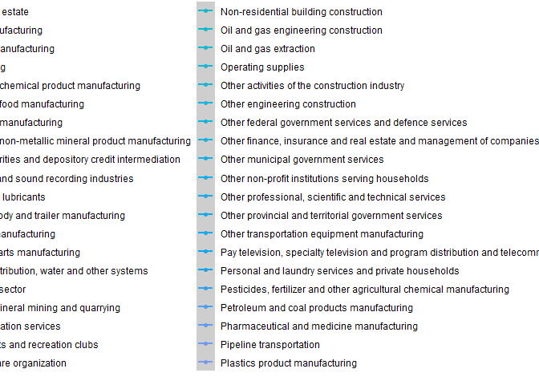<!-- -->

The resulting scatterplot have some portions cut off because there are
too many SECTOR categories. Try a subset of these categories:

``` r
library("dplyr")
co2data_order <- co2data %>% group_by(SECTOR) %>% summarise(co2mean = 
                            mean(co2_ann_kilotonnes)) %>% arrange(desc(co2mean))
```

In the code chunk above: the co2data is grouped by the variable SECTOR,
then the mean co2 ouptut of each sector is aggregated (displayed) in a
single row then the rows are arranged by descending order of the means.

``` r
View(co2data_order)
head(co2data_order)
```

    ## # A tibble: 6 × 2
    ##   SECTOR                                                   co2mean
    ##   <chr>                                                      <dbl>
    ## 1 Business sector                                          532864.
    ## 2 Electric power generation, transmission and distribution 109927.
    ## 3 Household sector                                         105156.
    ## 4 Oil and gas extraction                                    94623.
    ## 5 Crop and animal production                                64516.
    ## 6 Motor fuels and lubricants                                64245.

``` r
co2data_order_top10 <- co2data_order[1:10, ] # a new data set containing only the top 10 SECTORS by mean co2 output
```

``` r
top10 <- c(co2data_order_top10$SECTOR) # concatenates the values of the SECTOR column
top10[5] # the 5th element in the vector
```

    ## [1] "Crop and animal production"

From the original data, cull out observations in the top 10 sectors into
a new data:

``` r
co2_top10 <- co2data[co2data$SECTOR == top10[1] | co2data$SECTOR == top10[2] |
                       co2data$SECTOR == top10[3] | co2data$SECTOR == top10[4] |
                       co2data$SECTOR == top10[5] | co2data$SECTOR == top10[6] |
                       co2data$SECTOR == top10[7] | co2data$SECTOR == top10[8] |
                       co2data$SECTOR == top10[9] | co2data$SECTOR == top10[10], ]
nrow(co2_top10)
```

    ## [1] 190

``` r
tail(co2_top10)
```

    ##      year    GEO                     SECTOR co2_ann_kilotonnes
    ## 2218 2003 Canada Motor fuels and lubricants              70223
    ## 2219 2004 Canada Motor fuels and lubricants              71625
    ## 2220 2005 Canada Motor fuels and lubricants              73154
    ## 2221 2006 Canada Motor fuels and lubricants              72867
    ## 2222 2007 Canada Motor fuels and lubricants              75536
    ## 2223 2008 Canada Motor fuels and lubricants              74010

``` r
View(co2_top10)
```

Create a scatterplot for the top 10 sectors:

``` r
top10_scatter <- ggplot(co2_top10, aes(year, log(co2_ann_kilotonnes), colour = 
                                     as.factor(SECTOR))) + geom_point() + stat_smooth(method = "lm")
(top10_scatter)
```

    ## `geom_smooth()` using formula = 'y ~ x'

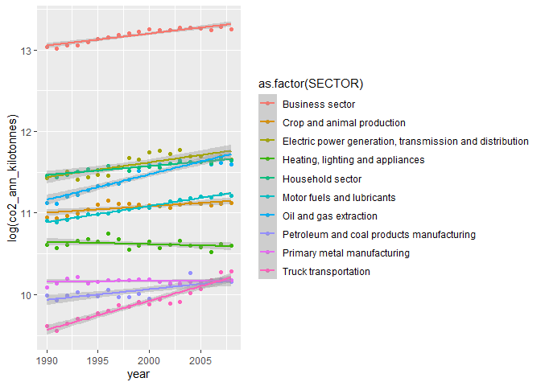<!-- -->

``` r
top10_scatter + theme_bw() # changes the background theme to black & white
```

    ## `geom_smooth()` using formula = 'y ~ x'

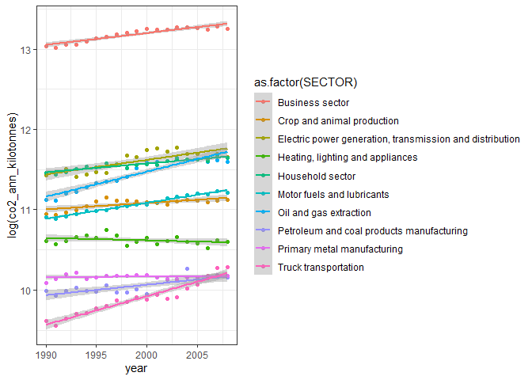<!-- -->

Make further changes to the plot:

``` r
top10_scatter <- ggplot(co2_top10, aes(year, log(co2_ann_kilotonnes), colour = 
                as.factor(SECTOR))) + geom_point() + stat_smooth(method = "lm") + theme(
                  plot.background = element_blank(),
                  panel.grid.major = element_blank(),
                  panel.grid.minor = element_blank(),
                  panel.background = element_blank(),
                  axis.line = element_line(colour = "black"),
                  axis.title.x = element_text(size = 19, colour = "black"),
                  axis.title.y = element_text(size = 19, colour = "black"),
                  axis.text.x = element_text(size = 12, colour = "black"),
                  axis.text.y = element_text(size = 12, colour = "black"),
                  legend.text = element_text(size = 12),
                  legend.title = element_text(size = 15),
                  legend.background = element_rect(color = "black", 
                                       size = .5,
                                       linetype = "solid")) + labs(x = "Year",
                    y = "Annual CO2 production (Log kilotonnes)") + scale_color_brewer(
                      palette = "Paired", name = "Sector")
top10_scatter
```

    ## `geom_smooth()` using formula = 'y ~ x'

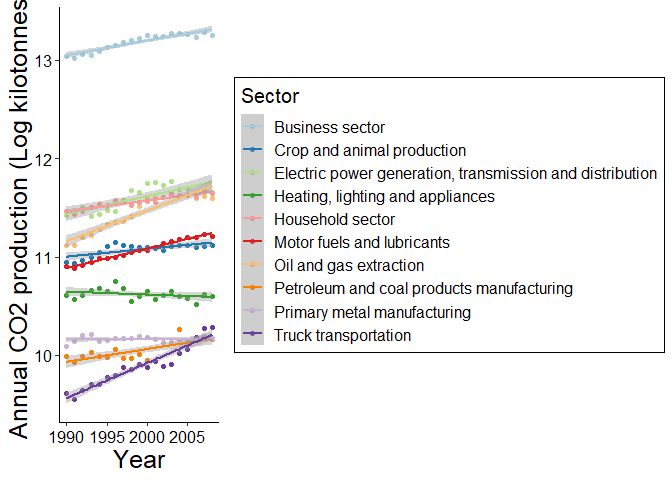<!-- -->

## Insetting Graphical Panels using ggplot2

``` r
setwd("G:/My Drive/Programming/Data Science/DATA SETS")
mydata <- read.csv("Mammal_lifehistories_v2.csv")
names(mydata)
```

    ##  [1] "order"        "family"       "genus"        "species"      "mass.g"      
    ##  [6] "gestation.mo" "newborn.g"    "weaning.mo"   "wean.mass.g"  "AFR.mo"      
    ## [11] "max.life.mo"  "litter.size"  "litters.year" "refs"

Remove observations with negative values (the coding for missing cases
in the current data):

``` r
mydata <- mydata[mydata$gestation.mo > 0 & mydata$mass.g > 0 & mydata$max.life.mo > 0, ]
head(mydata)
```

    ##          order         family       genus       species mass.g gestation.mo
    ## 1 Artiodactyla Antilocapridae Antilocapra     americana  45375         8.13
    ## 2 Artiodactyla        Bovidae       Addax nasomaculatus 182375         9.39
    ## 3 Artiodactyla        Bovidae   Aepyceros      melampus  41480         6.35
    ## 4 Artiodactyla        Bovidae  Alcelaphus    buselaphus 150000         7.90
    ## 6 Artiodactyla        Bovidae  Ammotragus        lervia  55500         5.08
    ## 7 Artiodactyla        Bovidae  Antidorcas   marsupialis  30000         5.72
    ##   newborn.g weaning.mo wean.mass.g AFR.mo max.life.mo litter.size litters.year
    ## 1   3246.36       3.00        8900  13.53         142        1.85         1.00
    ## 2   5480.00       6.50        -999  27.27         308        1.00         0.99
    ## 3   5093.00       5.63       15900  16.66         213        1.00         0.95
    ## 4  10166.67       6.50        -999  23.02         240        1.00      -999.00
    ## 6   3810.00       4.00        -999  14.89         251        1.37         2.00
    ## 7   3910.00       4.04        -999  10.23         228        1.00      -999.00
    ##                refs
    ## 1  1,2,6,9,23,26,27
    ## 2      1,2,17,23,26
    ## 3     1,2,8,9,23,29
    ## 4         1,2,17,23
    ## 6 1,2,9,11,17,23,29
    ## 7       1,2,9,23,27

Add new columns for the logs of mass and gestation:

``` r
mydata$log_mass <- log(mydata$mass.g)
mydata$log_gest <- log(mydata$gestation.mo)
head(mydata)
```

    ##          order         family       genus       species mass.g gestation.mo
    ## 1 Artiodactyla Antilocapridae Antilocapra     americana  45375         8.13
    ## 2 Artiodactyla        Bovidae       Addax nasomaculatus 182375         9.39
    ## 3 Artiodactyla        Bovidae   Aepyceros      melampus  41480         6.35
    ## 4 Artiodactyla        Bovidae  Alcelaphus    buselaphus 150000         7.90
    ## 6 Artiodactyla        Bovidae  Ammotragus        lervia  55500         5.08
    ## 7 Artiodactyla        Bovidae  Antidorcas   marsupialis  30000         5.72
    ##   newborn.g weaning.mo wean.mass.g AFR.mo max.life.mo litter.size litters.year
    ## 1   3246.36       3.00        8900  13.53         142        1.85         1.00
    ## 2   5480.00       6.50        -999  27.27         308        1.00         0.99
    ## 3   5093.00       5.63       15900  16.66         213        1.00         0.95
    ## 4  10166.67       6.50        -999  23.02         240        1.00      -999.00
    ## 6   3810.00       4.00        -999  14.89         251        1.37         2.00
    ## 7   3910.00       4.04        -999  10.23         228        1.00      -999.00
    ##                refs log_mass log_gest
    ## 1  1,2,6,9,23,26,27 10.72272 2.095561
    ## 2      1,2,17,23,26 12.11382 2.239645
    ## 3     1,2,8,9,23,29 10.63297 1.848455
    ## 4         1,2,17,23 11.91839 2.066863
    ## 6 1,2,9,11,17,23,29 10.92414 1.625311
    ## 7       1,2,9,23,27 10.30895 1.743969

``` r
# library(ggplot2) # library already opened previously
main <- ggplot(mydata, aes(log_mass, log_gest)) + geom_point() + theme_bw()
main
```

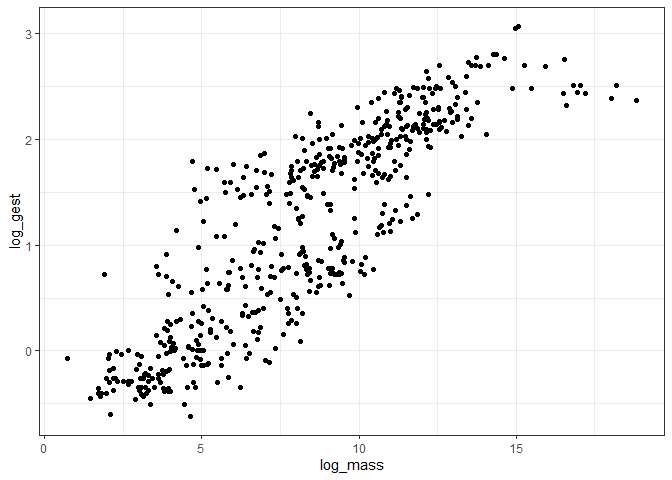<!-- -->

``` r
class(main)
```

    ## [1] "gg"     "ggplot"

``` r
sub <- main + geom_rect(data = mydata[1, ], xmin = 0, ymin = -1, xmax = 12, ymax =2.5,
                        fill = "blue", alpha = 0.5)
#* geom_rect = a geometric rectangle
#* alpha = transparency of the rectangle
```

``` r
sub$layers <- rev(sub$layers) # reorders the layers to draw rectangle below the points
```

``` r
main + annotation_custom(ggplotGrob(sub), xmin = 0.01, xmax = 5, ymin = 1.5, 
                         ymax = 3.3) + scale_x_continuous(
                           limits = c(0, 12)) + scale_y_continuous(limits = c(-1, 3.3))
```

    ## Warning: Removed 82 rows containing missing values (`geom_point()`).

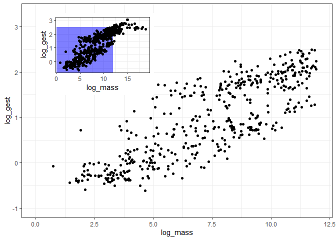<!-- -->

``` r
# xmin ... ymax: reads the coordinate of the inset within the main panel
# scale_x_continous: the lower and upper limits of the main panel's x axis
# scale_y_continous: the lower and upper limits of the main panel's y axis
```

> – The main panel now shows just a portion of the plot covered by the
> rectangle  
> – the sub panel (showing the blue rectangle and the rest of the entire
> graph) is insetat the top left of the larger panel
