Statistical Modeling
================
Toheeb
2024-03-28

# **Linear Regression**

Linear regression:  
\>– i) describes the relationship between variables (including at least
1 continuous); and  
\>– ii) tests for the evidence of a linear relationship of a given slope
between the two variables.

The term was coined by Francis Glaton 1889 (“regression to mediocrity”).
The overall approach was further developed by Pearson and Fisher.

Let’s do some modeling!!!

``` r
setwd("G:/My Drive/Programming/Data Science/DATA SETS")
gannet <- read.csv("GannetDataCSV.csv")
View(gannet)
head(gannet)
```

    ##      colony popsize sqrtpop tripduration  range
    ## 1      Bass   59429  243.78        18.28 128.89
    ## 2     Ailsa   45186  212.57        15.86 111.83
    ## 3 Hermaness   16520  128.53        10.72  75.59
    ## 4      Noss   10023  100.11        10.16  71.65
    ## 5   Bempton    2554   50.54         6.68  47.12
    ## 6    Saltee    2000   44.72        11.85  83.52

``` r
par(pch = 19) # sets the plot style
plot(gannet$sqrtpop, gannet$tripduration, xlab = "sqrt colonoy size",
     ylab = "trip duration (h)")
text(gannet$sqrtpop, gannet$tripduration, labels = gannet$colony, cex = 0.6, pos = 4) # this code labels points on the graph
```

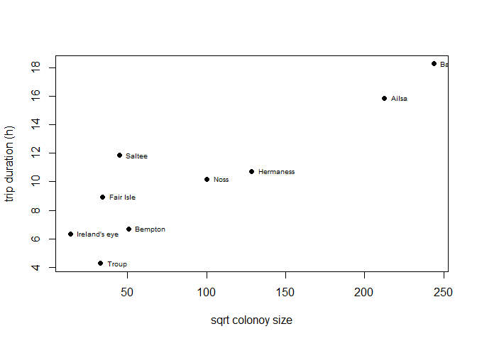<!-- -->

``` r
#   labels: defines the labeling rule/indicator for each point on the graph
#*  cex: character size of the label
#*  pos: position of each label relative to the corresponding point
```

``` r
# fit a linear model to the data
model <- lm(tripduration ~ sqrtpop, data = gannet)
```

``` r
# fit a regression line to the model
plot(gannet$sqrtpop, gannet$tripduration, xlab = "sqrt colonoy size",
     ylab = "trip duration (h)")
text(gannet$sqrtpop, gannet$tripduration, labels = gannet$colony, cex = 0.6, pos = 4)
abline(model)
```

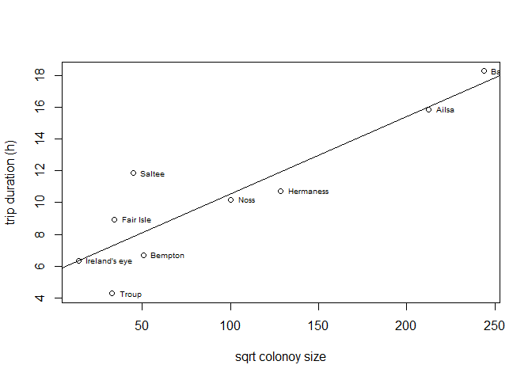<!-- -->

``` r
# obtain descriptors of the model
summary(model) 
```

    ## 
    ## Call:
    ## lm(formula = tripduration ~ sqrtpop, data = gannet)
    ## 
    ## Residuals:
    ##     Min      1Q  Median      3Q     Max 
    ## -3.0075 -1.2243 -0.1783  0.7213  3.9884 
    ## 
    ## Coefficients:
    ##             Estimate Std. Error t value Pr(>|t|)   
    ## (Intercept) 5.683034   1.117679   5.085  0.00142 **
    ## sqrtpop     0.048715   0.009022   5.400  0.00101 **
    ## ---
    ## Signif. codes:  0 '***' 0.001 '**' 0.01 '*' 0.05 '.' 0.1 ' ' 1
    ## 
    ## Residual standard error: 2.131 on 7 degrees of freedom
    ## Multiple R-squared:  0.8064, Adjusted R-squared:  0.7787 
    ## F-statistic: 29.16 on 1 and 7 DF,  p-value: 0.001009

``` r
# Get the confidence intervals of the model estimates
confint(model) 
```

    ##                  2.5 %     97.5 %
    ## (Intercept) 3.04014366 8.32592515
    ## sqrtpop     0.02738171 0.07004781

Can also run ANOVA on the same data/model:

``` r
anova(model)
```

    ## Analysis of Variance Table
    ## 
    ## Response: tripduration
    ##           Df  Sum Sq Mean Sq F value   Pr(>F)   
    ## sqrtpop    1 132.433 132.433  29.157 0.001009 **
    ## Residuals  7  31.795   4.542                    
    ## ---
    ## Signif. codes:  0 '***' 0.001 '**' 0.01 '*' 0.05 '.' 0.1 ' ' 1

Results: the p-value is the same as observed in the linear regression
model.

## Evaluating the assumptions of linear regression

### Assumption 1 (homogeneity of variance)

``` r
plot(model, which = 1)
```

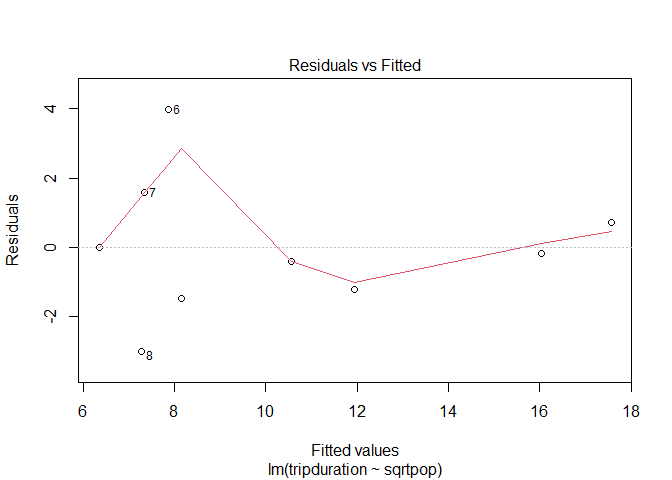<!-- -->

Results: there isn’t evidence of dramatic changes in variance. Hence,
assumption 1 (i.e., homogeneity of error variance) holds!

### Assumption 2 (Linearity)

``` r
# obtain a Q-Q plot
plot(model, which = 2) 
```

<!-- -->

Results: the points are relatively linear. To be sure, one could plot
the standard residuals on a histogram:

``` r
sresids <- rstandard(model)
hist(sresids)
```

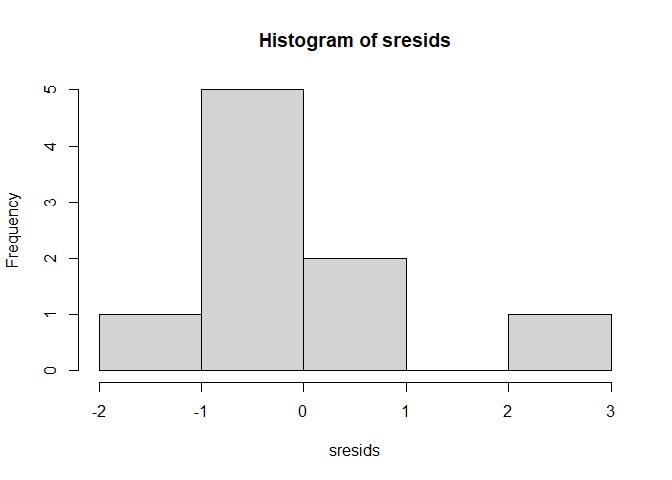<!-- -->

Results: Hard to tell due to small sample size, but there seems to be no
dramatic departure from normality.

## Prediction

A linear regression model can also be used for prediction. E.g., predict
the tripduration when the sqrtpop is 100:

``` r
predict(model, list(sqrtpop = 100))
```

    ##        1 
    ## 10.55451

Results: tripduration = 10.55451. \[This can be confirmed on the lin reg
graph\]

We can also check predictability of the whole data. E.g., assess the 95%
prediction intervals of the data (i.e., the range under which 95% of y
should fall for a given value of x)

``` r
plot(gannet$sqrtpop, gannet$tripduration, xlab = "sqrt colonoy size",
     ylab = "trip duration (h)")
text(gannet$sqrtpop, gannet$tripduration, labels = gannet$colony, cex = 0.6, pos = 4)
# the above codes are reproduced from earlier ones. See the "NB" note below

xv <- seq(0,250,0.1)
yv <- predict(model, list(sqrtpop = xv), int = "prediction", level = 0.95)
matlines(xv, yv, lty = c(1,2,2), col = "red") # highlights the prediction intervals on the graph
```

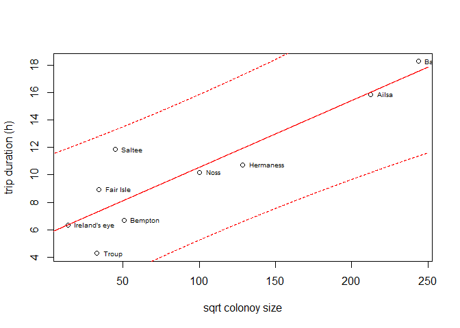<!-- -->

``` r
# lty (line type): defines the line designs (1=solid, 2=dashed, 3= dotted, etc.)

#NB: The abline, matlines, etc. functions don't work unless the plot function is recalled each time.
```

## ——————————————————————————–

------------------------------------------------------------------------

# **Multiple Linear Regression**

Ex: Predicting age at death of known statisticians

``` r
setwd("G:/My Drive/Programming/Data Science/DATA SETS")
statisticians <- read.csv("StatisticiansAgesCSV.csv")
View(statisticians)
head(statisticians)
```

    ##   Birth.Year Death.Year Age.on.Death         Statistician
    ## 1       1781       1840           58       Simeon Poisson
    ## 2       1822       1911           88       Francis Galton
    ## 3       1857       1936           79         Karl Pearson
    ## 4       1863       1945           82    Charles  Spearman
    ## 5       1876       1937           61 William Sealy Gosset
    ## 6       1881       1974           92      George Snedecor

Use a plot to visualize the data:

``` r
plot(statisticians$Birth.Year, statisticians$Age.on.Death, xlab = "Date of Birth",
     ylab = "Age")
text(statisticians$Birth.Year, statisticians$Age.on.Death, 
     labels = statisticians$Statistician, cex = 0.5, pos = 1)
```

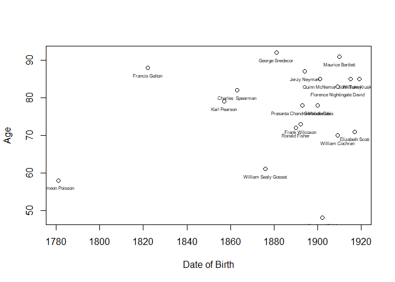<!-- -->

``` r
# fit a linear model to the data (Using Birth.year as IV)
model1 <- lm(Age.on.Death ~ Birth.Year, data = statisticians)

# run ANOVA on the linear model
anova(model1)
```

    ## Analysis of Variance Table
    ## 
    ## Response: Age.on.Death
    ##            Df  Sum Sq Mean Sq F value Pr(>F)
    ## Birth.Year  1  107.81  107.81  0.7712 0.3921
    ## Residuals  17 2376.71  139.81

Results: p-value=0.3921. DO NOT reject the null hypothesis (NH) that age
and birth year are independent of one another (i.e., there is no
evidence of a relationship between the two variables).

Repeat the analysis, this time using Death year as IV:

``` r
model2 <- lm(statisticians$Age.on.Death ~ statisticians$Death.Year)
anova(model2)
```

    ## Analysis of Variance Table
    ## 
    ## Response: statisticians$Age.on.Death
    ##                          Df  Sum Sq Mean Sq F value  Pr(>F)  
    ## statisticians$Death.Year  1  597.39  597.39  5.3815 0.03305 *
    ## Residuals                17 1887.14  111.01                  
    ## ---
    ## Signif. codes:  0 '***' 0.001 '**' 0.01 '*' 0.05 '.' 0.1 ' ' 1

Results: p-value=0.03305. REJECT the NH that age and death year are
independent (i.e., there is evidence of a linear relationship between
both).

How are they related? Check the coefficients:

``` r
model2$coeff
```

    ##              (Intercept) statisticians$Death.Year 
    ##             -212.3283710                0.1474397

Results: coefficient=0.1474. Interpretation: For each unit increase in
death year, age on death increases by 0.147 units.

Fit a line representing the model2 equation:

``` r
plot(statisticians$Birth.Year, statisticians$Age.on.Death, xlab = "Date of Birth",
     ylab = "Age")
text(statisticians$Birth.Year, statisticians$Age.on.Death, 
     labels = statisticians$Statistician, cex = 0.5, pos = 1)


abline(coef = c(model2$coeff[1],model2$coeff[2]), col = "red") # equation for model 2
```

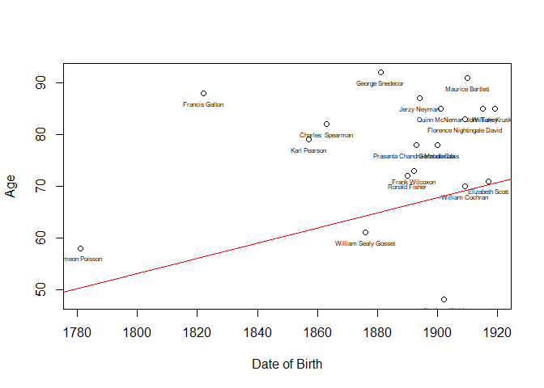<!-- -->

## Model both IVs (multiple regression - MR)

``` r
model3 <- lm(statisticians$Age.on.Death ~ statisticians$Death.Year + 
               statisticians$Birth.Year)
```

### Significance of Effects

``` r
anova(model3)
```

    ## Analysis of Variance Table
    ## 
    ## Response: statisticians$Age.on.Death
    ##                          Df  Sum Sq Mean Sq F value    Pr(>F)    
    ## statisticians$Death.Year  1  597.39  597.39  2447.5 < 2.2e-16 ***
    ## statisticians$Birth.Year  1 1883.23 1883.23  7715.7 < 2.2e-16 ***
    ## Residuals                16    3.91    0.24                      
    ## ---
    ## Signif. codes:  0 '***' 0.001 '**' 0.01 '*' 0.05 '.' 0.1 ' ' 1

Results: both predictors are highly significant (p\<2.2e-16 each). Why
does birth year become significant? \[Recall that it was not significant
in the bivariable (i.e., single IV) model\]  
\>– Answer: in the current model, death year is held constant meaning
that, birth year becomes significant when we control for death year.  
*PS: the default ANOVA approach in a multivariable analysis is called
TYPE I SUM OF SQUARES. That is, the focus is on the last IV in the
series; every other IV before/above it is held constant in the model.*

Note that each IV now has a lower p-value. This is due to multiple IVs
in a model. Specifically, having more than one IV (i.e., MR) reduces the
error variability, lower than the simple model. This results in a lower
p-value.

``` r
# obtain the model coefficient
model3$coef
```

    ##              (Intercept) statisticians$Death.Year statisticians$Birth.Year 
    ##               -6.5377735                0.9850403               -0.9811814

Because there are multiple IVs in R, the results can not be visualized
in a 2-D plot. Instead, use the avPlots function in the car library:

``` r
library(car)
```

    ## Warning: package 'car' was built under R version 4.3.2

    ## Loading required package: carData

    ## Warning: package 'carData' was built under R version 4.3.2

``` r
avPlots(model3)
```

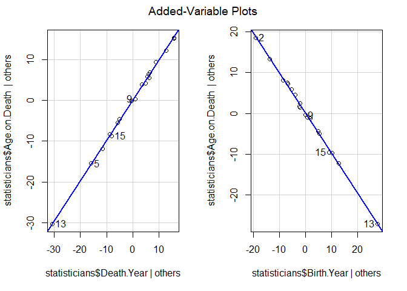<!-- -->

### THE TYPE III SUM OF SQUARES APPROACH

This method simultaneously adjusts for the effects of all other
predictors in the model.

``` r
# Type III SS uses the 'Anova' function in the 'car' package (loaded earlier)
Anova(model3, type = "III") #Note the capital A in "Anova"
```

    ## Anova Table (Type III tests)
    ## 
    ## Response: statisticians$Age.on.Death
    ##                           Sum Sq Df   F value Pr(>F)    
    ## (Intercept)                 0.26  1    1.0755 0.3151    
    ## statisticians$Death.Year 2372.81  1 9721.4881 <2e-16 ***
    ## statisticians$Birth.Year 1883.23  1 7715.6809 <2e-16 ***
    ## Residuals                   3.91 16                     
    ## ---
    ## Signif. codes:  0 '***' 0.001 '**' 0.01 '*' 0.05 '.' 0.1 ' ' 1

Results: each predictor (Death year and Birth year) is highly
significant when controlling for the other.

## EVALUATING THE ASSUMPTIONS OF THE GENERAL LINEAR MODEL

### Assumption 1: homogeneity

``` r
plot(model3, which = 1)
```

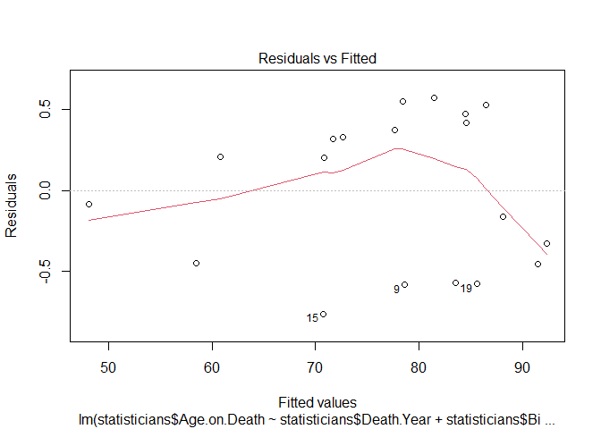<!-- -->

Results: there are no apparent significant changes across the error
variance. So, assumption 1 seems to hold.

### Assumption 2: Normality

``` r
plot(model3, which = 2)
```

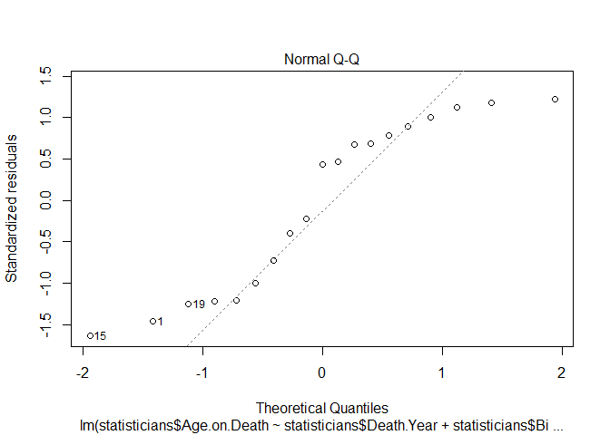<!-- -->

Results: the Q-Q plot suggests a non-normal data. Assumption 2 may have
been violated! To be sure, check the histogram distribution of the
standard residuals:

``` r
sresids <- rstandard(model3)
hist(sresids)
```

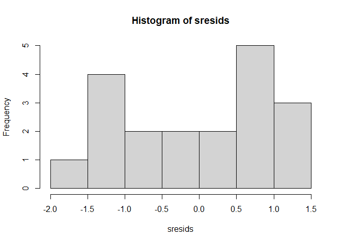<!-- -->

Results: the histogram shows a bivariate shape, rather than the
univariate appearance that characterizes a normal distribution. So it
appears that the assumption is violated. Note, however, that this is a
small sample.

## ——————————————————————————–

------------------------------------------------------------------------

# **Logistic Regression**

The logistic regression is a generalized linear model and will work for
both continuous and categorical predictors.

NB: General Linear Model assumes the residuals/errors follow a normal
distribution. Generalized Linear Model, on the other hand, allows
residuals to have other distributions from the exponential family of
distributions.

## Hypothesis testing in logistic regression

Testing the hypothesis that a coefficient on a predictor variable is
different from zero at population level uses the “Wald statistic” (*z*
in R). The Wald statistic is simply the square of the regular
*t*-statistic. If the NH is true, then it has a particular distribution
(the chi-square).

``` r
puffinbill <- read.csv("G:/My Drive/Programming/Data Science/DATA SETS/puffinbill.csv")
View(puffinbill)
head(puffinbill)
```

    ##   bird sex curlen
    ## 1    1   M   44.1
    ## 2    2   M   44.0
    ## 3    3   M   44.1
    ## 4    4   M   42.6
    ## 5    5   M   46.4
    ## 6    6   M   42.2

``` r
# three columns:
# bird = bird ID
# sex = bird's sex (male or female)
# curlen = size/length of the bird's bill
```

``` r
sex <- puffinbill$sex
curlen <- puffinbill$curlen
sexcode <- ifelse(sex == "F", 1, 0) # recode sex (female=1; male=0)
```

``` r
# plot a graph
plot(curlen, jitter(sexcode, 0.15), pch = 19,
     xlab = "Bill lenght (mm)", ylab = "Sex (0 - male, 1 - female)")
```

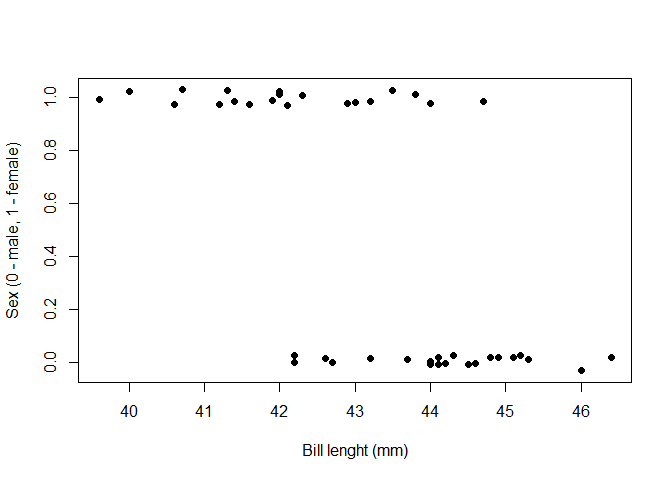<!-- -->

``` r
#NB: the jitter prevents overlapping (i.e., in cases of individuals of same sex having similar bill length)
```

According to the the graph, males tend to have generally longer bills
than females.

Now let’s fit a binary regression (logistic) model to the data:

``` r
model <- glm(sexcode~curlen, binomial)
summary(model)
```

    ## 
    ## Call:
    ## glm(formula = sexcode ~ curlen, family = binomial)
    ## 
    ## Deviance Residuals: 
    ##     Min       1Q   Median       3Q      Max  
    ## -1.7338  -0.6762  -0.1699   0.6311   2.0676  
    ## 
    ## Coefficients:
    ##             Estimate Std. Error z value Pr(>|z|)    
    ## (Intercept)  56.3369    16.7506   3.363  0.00077 ***
    ## curlen       -1.3053     0.3873  -3.370  0.00075 ***
    ## ---
    ## Signif. codes:  0 '***' 0.001 '**' 0.01 '*' 0.05 '.' 0.1 ' ' 1
    ## 
    ## (Dispersion parameter for binomial family taken to be 1)
    ## 
    ##     Null deviance: 56.814  on 40  degrees of freedom
    ## Residual deviance: 35.161  on 39  degrees of freedom
    ## AIC: 39.161
    ## 
    ## Number of Fisher Scoring iterations: 5

As shown in the output, we reject the NH that the bill length has no
impact on sex (p=0.00075)

Now, let’s plot a line of this model on the graph:

``` r
plot(curlen, jitter(sexcode, 0.15), pch = 19,
     xlab = "Bill lenght (mm)", ylab = "Sex (0 - male, 1 - female)")
#NB: Recall that the graph must be recreated (using the plot function as done here) in each code chunk for the desired line(s) [i.e., using lines, abline, or similar function] to be displayed on the graph .
xv <- seq(min(curlen), max(curlen), 0.01)
yv <- predict(model, list(curlen = xv), type = "response")
lines(xv, yv, col = "red") # code for the sigmoidal curve - the curve for binary outcomes
```

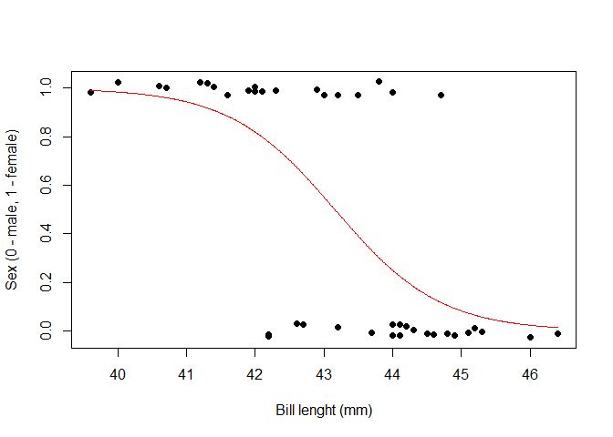<!-- -->

Alternatively, one could use the logi.hist.plot() function in “popbio”
library:

``` r
# install.packages("popbio") #the library hadn't been previously installed
library(popbio)
```

    ## Warning: package 'popbio' was built under R version 4.3.1

``` r
# Now plot the graph
logi.hist.plot(curlen, sexcode, boxp = FALSE, type = "count", col = "gray", xlabel = "size")
```

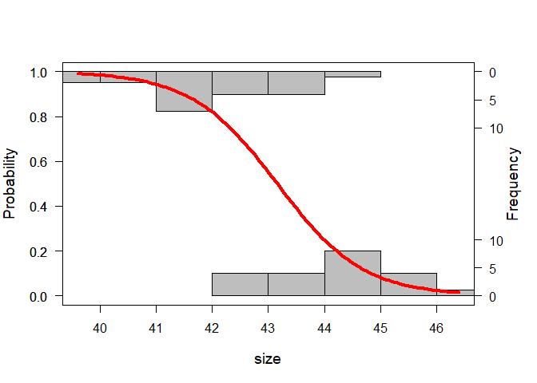<!-- -->

## ——————————————————————————–

------------------------------------------------------------------------

# **Polynomial Regression**

``` r
fluoride <- read.csv("G:/My Drive/Programming/Data Science/DATA SETS/FlourideDMF.csv")
View(fluoride)
head(fluoride)
```

    ##   DMFper100 FlouridePPM
    ## 1       236         1.9
    ## 2       246         2.6
    ## 3       252         1.8
    ## 4       258         1.2
    ## 5       281         1.2
    ## 6       303         1.2

Assign x and y variables:

``` r
y <- fluoride$DMFper100
x <- fluoride$FlouridePPM
```

Obtain polynomials of x (i.e., the IV):

``` r
xsq <- x^2
xcub <- x^3
xquar <- x^4
```

Create a simple plot of y (i.e., the DV) vs x:

``` r
plot(x, y, pch = 19, xlab = "Fluoride concentration in water", ylab = "DMF index")
```

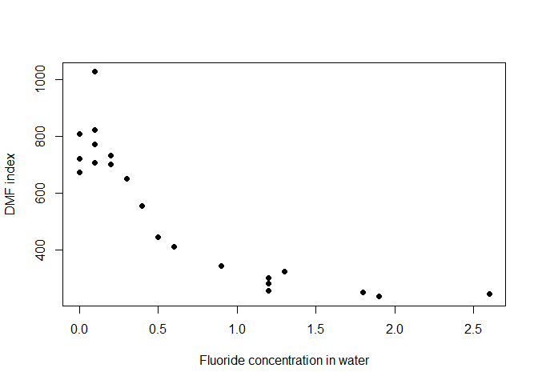<!-- -->

Fit a simple linear model to the data:

``` r
fit1 <- lm(y~x)
```

Examine the model by calling the anova function:

``` r
anova(fit1)
```

    ## Analysis of Variance Table
    ## 
    ## Response: y
    ##           Df Sum Sq Mean Sq F value    Pr(>F)    
    ## x          1 866831  866831  53.472 6.199e-07 ***
    ## Residuals 19 308005   16211                      
    ## ---
    ## Signif. codes:  0 '***' 0.001 '**' 0.01 '*' 0.05 '.' 0.1 ' ' 1

As shown in the results above, x explains significant variability in y
(p\<0.001).

Fit the model onto the previous graph:

``` r
plot(y~x)
abline(lm(y~x), col = "red")
```

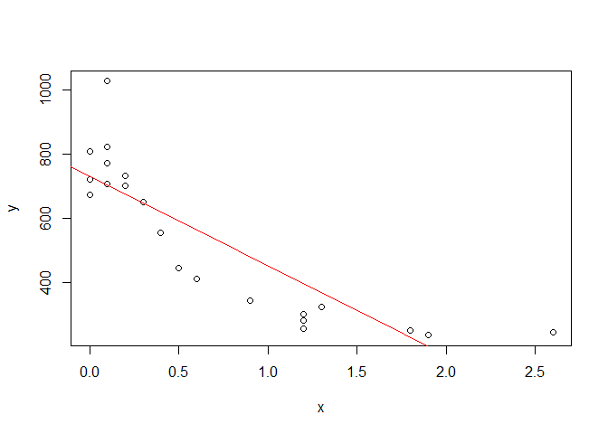<!-- -->

``` r
# NB: simply calling the abline function doesn't work. Must use the plot function first, as shown
```

Notice that there is some curvature in the data. Perhaps a higher-order
model would be more appropriate than a linear one. Let’s try fitting a
quadratic term:

``` r
# to fit a higher-order model, add the higher-order term to the existing model
fit2 <- lm(y~x+xsq)
anova(fit2)
```

    ## Analysis of Variance Table
    ## 
    ## Response: y
    ##           Df Sum Sq Mean Sq F value    Pr(>F)    
    ## x          1 866831  866831 112.155 3.668e-09 ***
    ## xsq        1 168885  168885  21.851 0.0001887 ***
    ## Residuals 18 139120    7729                      
    ## ---
    ## Signif. codes:  0 '***' 0.001 '**' 0.01 '*' 0.05 '.' 0.1 ' ' 1

As shown in the results above, the simple term (x) still explains
significant variability in y (p\<0.001), and the new complex term
(x<sup>2</sup>) explains a significant additional variability
(p=0.0002). Now, let’s fit the new model onto the graph:

``` r
xv <- seq(min(x), max(x), 0.01) # xv stands for x values
yv <- predict(fit2, list(x = xv, xsq = xv^2)) # yv stands for y values
plot(x,y)
abline(lm(y~x), col = "red") # NB: this code is for the previous linear form 
lines(xv, yv, col = "green") # the quadratic form
```

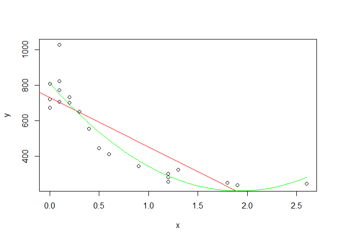<!-- -->

As seen in the above plot, the new model now explains some of the
curvature in the data. Thus, the quadratic model fits the data better
than the linear model.

Let’s try an even more complicated model (by adding a cubic term):

``` r
fit3 <- lm(y~x+xsq+xcub)
anova(fit3)
```

    ## Analysis of Variance Table
    ## 
    ## Response: y
    ##           Df Sum Sq Mean Sq  F value    Pr(>F)    
    ## x          1 866831  866831 109.7842 7.778e-09 ***
    ## xsq        1 168885  168885  21.3893 0.0002419 ***
    ## xcub       1   4892    4892   0.6195 0.4420582    
    ## Residuals 17 134228    7896                       
    ## ---
    ## Signif. codes:  0 '***' 0.001 '**' 0.01 '*' 0.05 '.' 0.1 ' ' 1

The linear and quadratic terms each explain significant variability in
y. But the cubic term explains no significant additional variability
(p=0.442). Now let’s see how everything lines up on the graph:

``` r
cubic <- predict(fit3, list(x = xv, xsq = xv^2, xcub = xv^3)) # xv has been defined earlier; y values are now defined as "cubic"
plot(x,y)
abline(lm(y~x), col = "red") # NB: this code is for the previous linear form 
lines(xv, yv, col = "green") # NB: this code is for the previous quadratic form
lines(xv, cubic, col = "black") # the cubic form
```

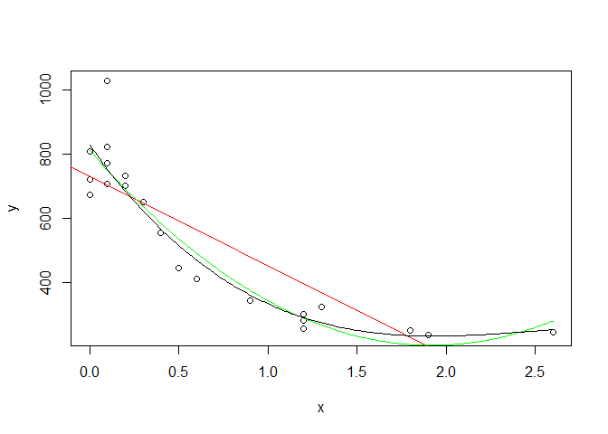<!-- -->
Again, the cubic term doesn’t seem to introduce a new information (i.e.,
no new contribution different from that of the quadratic). So, the
quadratic seems to be the best fit.

Let’s check the GLM assumption of the models (quadratic vs linear).  
Assumption 1 – Homogeneity of the error variance

``` r
plot(fit2, which = 1) # the error variance is relatively homogeneous. Compare this to that of the linear model (shown next)
```

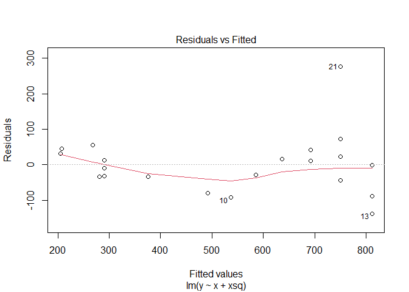<!-- -->

``` r
plot(fit1, which = 1) # the error variance is not homogenous. This GLM assumption is therefore violated, making the linear model an inappropriate fit for the data (as has been shown in previous analyses)
```

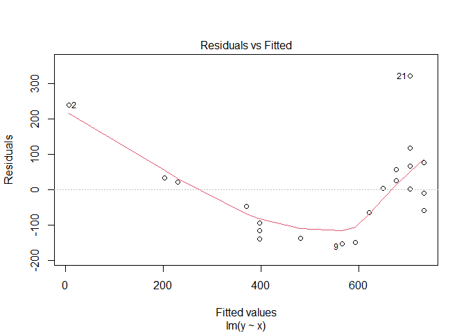<!-- -->

Assumption 2 — normality

``` r
plot(fit2, which = 2)
```

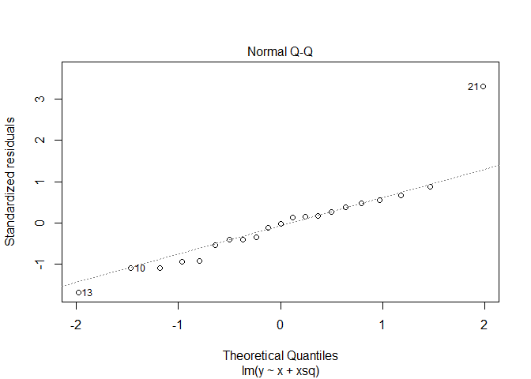<!-- -->

``` r
plot(fit1, which = 2)
```

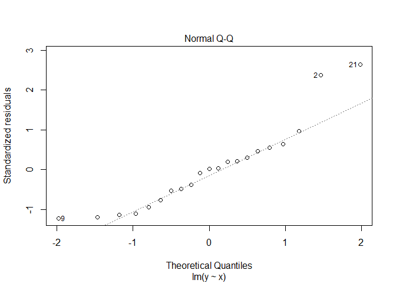<!-- -->

``` r
hist(rstandard(fit2))
```

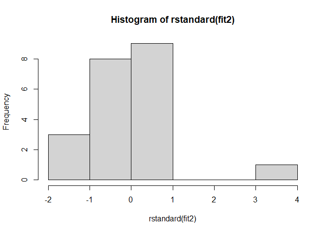<!-- -->

``` r
hist(rstandard(fit1))
```

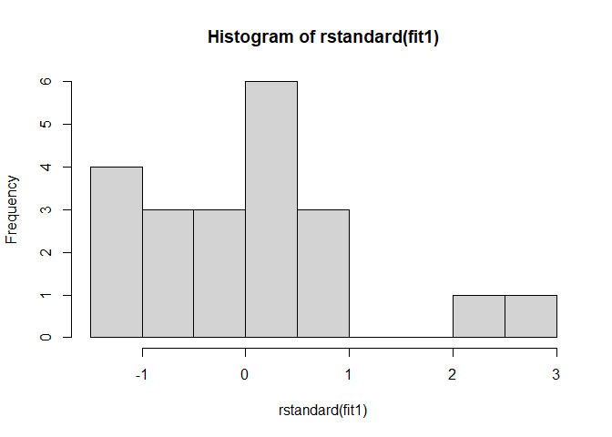<!-- -->

Results: the quadratic model assumes a more “normal” shape than the
linear model, again making the former a better fit.

## ——————————————————————————–

------------------------------------------------------------------------

# **One-way ANOVA (Analysis of Variance)**

> – variance: the average squared deviation of all the observations from
> the population mean  
> – standard deviation: square root of variance

If pairs of samples are repeatedly drawn from the same normally
distributed population (or two different normally distributed
populations with the same variance), then the ratio
s<sub>1</sub><sup>2</sup>/s<sub>2</sub><sup>2</sup> will follow an
F-distribution.

According to Ronald Fisher, the ANOVA is not a mathematical theorem, but
rather a convenient method of arranging the arithmetic. ANOVA: checks if
there is a statistically significant difference between two or more
groups by testing the difference between the groups’ means.

ANOVA is usually between a continuous DV and ≥1 categorical IV.

Total variation = variation within groups + variation between groups,
i.e., SS<sub>total</sub> = SS<sub>within</sub> + SS<sub>between</sub>

If there is a treatment effect, then one would expect the between-group
variation to be higher than the within-group variation.

**p-value**  
\>– general definition: the probability that we would get at least the
observed effect if the null hypothesis (NH) were true.  
\>– ANOVA definition: the probability of getting at least the observed
F-ratio if the NH were true.

## PRACTICE PROBLEM

``` r
setwd("G:/My Drive/Programming/Data Science/DATA SETS")
fertData <- read.csv("FertiliserCSV.csv")
View(fertData)
```

Use a stripchart function to visualize the data:

``` r
# a stripchart produces a 1-dimensional scatter plot
stripchart(yield ~ as.factor(fertil), vertical = T, pch = 19, data = fertData,
           xlab = "fertilizer type", ylab = "yield in tonnes / ha",
           method = "jitter", jitter = 0.04)
```

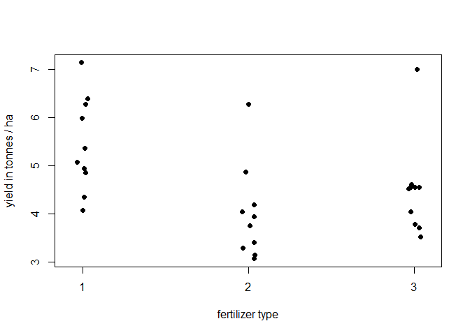<!-- -->

``` r
#* vertical: when set to TRUE, plot is drawn vertically (NB: default is False)
#* pch (plot character): defines the plot style (19 = sphere/circle, 17 = triangle, 3 = plus, etc.)
#* jitter: applies to overlapping points (???)
```

From the graph, the yield from fertilizer 1 appears to be generally
higher than yield from the other fertilizers. Let’s check whether this
is a significant difference.  
First, fit a linear model to the data:

``` r
analysis <- lm(yield ~ as.factor(fertil), data = fertData)
```

Next, run ANOVA on the model:

``` r
anova(analysis)
```

    ## Analysis of Variance Table
    ## 
    ## Response: yield
    ##                   Df Sum Sq Mean Sq F value   Pr(>F)   
    ## as.factor(fertil)  2 10.823  5.4114  5.7024 0.008594 **
    ## Residuals         27 25.622  0.9490                    
    ## ---
    ## Signif. codes:  0 '***' 0.001 '**' 0.01 '*' 0.05 '.' 0.1 ' ' 1

Interpretation of results: assuming the NH were true, the probability of
observing an F value of at least 5.7024 is 0.008594. So we reject the NH
that yield was equal across the three fertilizer types.

### CHECKING ANOVA ASSUMPTIONS

To confirm the above interpretation, we should check that the
assumptions underlying the ANOVA (as applicable to other members of the
general linear model) have not been violated.

#### Assumption 1: Homogeneity of the error variance

``` r
plot(analysis, which = 1) #* which=1: instructs R to check assumption 1
```

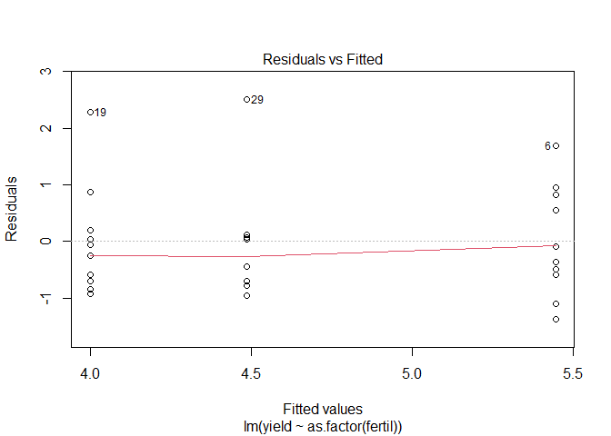<!-- -->

Results: as seen on the graph, the variance is relatively homogeneous
across each level of the data (Recall: there are 3 fertilizer
levels/types). The assumption is not violated!

#### Assumption 2: Normality of the overall distribution of the residuals

``` r
plot(analysis, which = 2) # creates a Q-Q plot; which=2: instructs R to check assumption 2
```

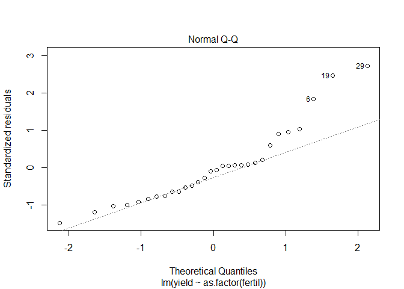<!-- -->

Results: some points on the graph do not align linearly with the rest
(i.e., some skewing is present). To visualize this more directly:

``` r
sresids <- rstandard(analysis) # obtains the standardized residuals of the model
hist(sresids) # plots a histogram of the standardized residuals
```

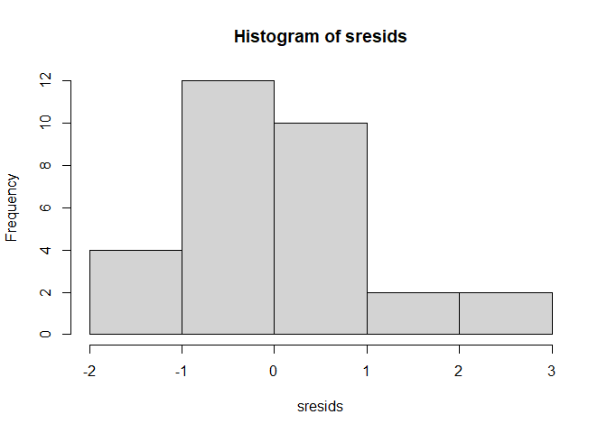<!-- -->

Results: the data is positively-skewed (to the right), but not too much
to worry about (according to the R LABS tutorial on YouTube)

### POST-HOC ANALYSIS

From the above analyses, it can be concluded that the fertilizers do not
have the same yield. But wherein lies the difference? A post-hoc test
addresses this question. An example of a post-hoc test is Tukey’s HSD
(honestly significant difference) test:

``` r
TukeyHSD(aov(analysis))
```

    ##   Tukey multiple comparisons of means
    ##     95% family-wise confidence level
    ## 
    ## Fit: aov(formula = analysis)
    ## 
    ## $`as.factor(fertil)`
    ##       diff        lwr        upr     p adj
    ## 2-1 -1.446 -2.5261662 -0.3658338 0.0070788
    ## 3-1 -0.958 -2.0381662  0.1221662 0.0894812
    ## 3-2  0.488 -0.5921662  1.5681662 0.5102335

Results: the significant difference lies in fertilizer 2 vs. 1. Other
differences (3vs1 and 3vs2) are not statistically significant.

## ——————————————————————————–

------------------------------------------------------------------------

# **Randomized Block Designs (a.k.a two-way ANOVA)**

Basically, in 2-way ANOVA, there are two categorical predictors \[1-way
ANOVA has only one predictor which is also categorical\] and one
continuous response

## PRACTICE Example

``` r
weight <- c(0.958, 0.971, 0.927, 0.971, 0.986, 1.051, 0.891, 1.010,
            0.925, 0.952, 0.829, 0.955)
experiment <- factor(rep(1:4,3)) # NB: the rep function here renders the object as 1234 1234 1234, i.e., the series is repeated
genotype <- rep(c("wild", "red", "hairy"), each = 4) # NB: the rep function here repeats each element the specified number of times before the next element (i.e. wild wild wild wild red red red ...)
```

``` r
stripchart(weight ~ genotype, vertical = T, pch = 19, xlab = "Genotype", ylab = "Weight",
           method = "jitter", jitter = 0.04)
```

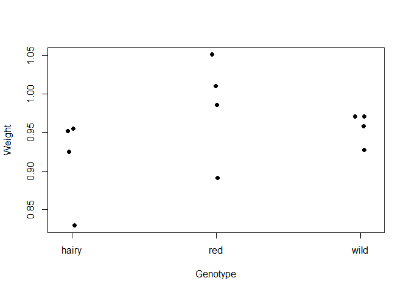<!-- -->

Results: the red genotype seems to have a generally heavier weight than
the other two.

Now, let’s analyze the differences/relationships. First, try out a silly
approach (a simple 1-way ANOVA) that ignores the experiment variable:

``` r
sillyresults <-  lm(weight ~ genotype) 
anova(sillyresults)
```

    ## Analysis of Variance Table
    ## 
    ## Response: weight
    ##           Df    Sum Sq   Mean Sq F value Pr(>F)
    ## genotype   2 0.0097172 0.0048586  1.7098 0.2348
    ## Residuals  9 0.0255745 0.0028416

Results: p-value=0.2348; we can’t reject the NH that genotype has no
effect on weight (i.e., there is no evidence that genotype has an effect
on weight). But is that actually true?

To answer, try the more appropriate approach – a 2-way ANOVA that
includes the experiment variable. Why would this be helpful? Because it
would help account for variability that would otherwise be treated as
noise in the 1-way model:

``` r
results <- lm(weight ~ genotype+experiment)
anova(results)
```

    ## Analysis of Variance Table
    ## 
    ## Response: weight
    ##            Df    Sum Sq   Mean Sq F value   Pr(>F)   
    ## genotype    2 0.0097172 0.0048586  6.9682 0.027259 * 
    ## experiment  3 0.0213910 0.0071303 10.2264 0.008967 **
    ## Residuals   6 0.0041835 0.0006972                    
    ## ---
    ## Signif. codes:  0 '***' 0.001 '**' 0.01 '*' 0.05 '.' 0.1 ' ' 1

Results: both IVs each have significant effect on weight. Although
because this is a default Type I SS approach, these results imply that
genotype is being controlled for.

Let’s try changing the order in which the IVs are entered into the
model:

``` r
results2 <- lm(weight ~ experiment+genotype)
anova(results2)
```

    ## Analysis of Variance Table
    ## 
    ## Response: weight
    ##            Df    Sum Sq   Mean Sq F value   Pr(>F)   
    ## experiment  3 0.0213910 0.0071303 10.2264 0.008967 **
    ## genotype    2 0.0097172 0.0048586  6.9682 0.027259 * 
    ## Residuals   6 0.0041835 0.0006972                    
    ## ---
    ## Signif. codes:  0 '***' 0.001 '**' 0.01 '*' 0.05 '.' 0.1 ' ' 1

Results: same as the previous ordering. Same p-values, F-values. This is
because the two vars are not collinear with one another \[the genotypes
are equally distributed within each experiment, i.e., each experiment
has exactly one (not less or more) type of the genotypes. So one can’t
guess the type of experiment by looking just at the genotype, or vice
versa\]. In short, there is complete ORTHOGONALITY!!! So there is really
no need to control for either variable. There is obviously no
possibility of confounding! \[If there was, one could run the type III
Anova\]

Now, let’s check the residuals (for the GLM assumptions)

``` r
par(mfrow = c(1,2))
plot(results, which = 1)
plot(results, which = 2)
```

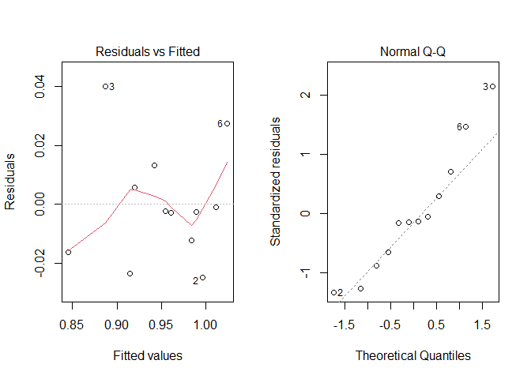<!-- -->

Results: Broadly speaking, there is nothing to worry about. Both
assumptions appear to check out. The results are not exactly perfect,
but again this is a small sample.

Check assumption 2 on a histogram:

``` r
sres <- rstandard(results)
hist(sres)
```

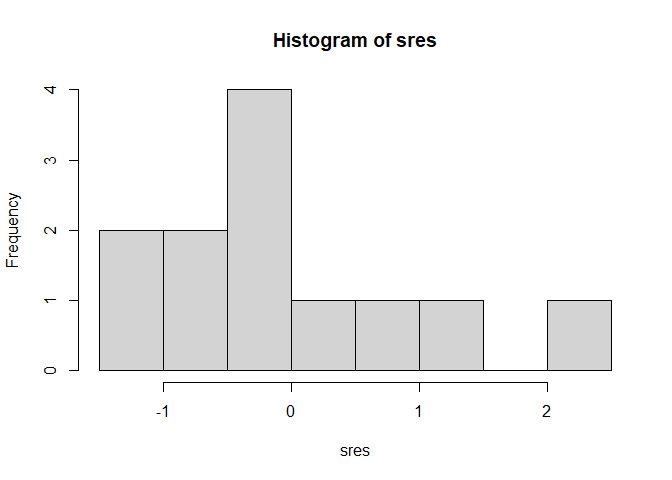<!-- -->

Let’s check exactly where the difference lies in the genotype groups

``` r
TukeyHSD(aov(results), "genotype")
```

    ##   Tukey multiple comparisons of means
    ##     95% family-wise confidence level
    ## 
    ## Fit: aov(formula = results)
    ## 
    ## $genotype
    ##                diff         lwr        upr     p adj
    ## red-hairy   0.06925  0.01196071 0.12653929 0.0232792
    ## wild-hairy  0.04150 -0.01578929 0.09878929 0.1454294
    ## wild-red   -0.02775 -0.08503929 0.02953929 0.3611755

Results: the actual difference lies in red vs. hairy (p-value=0.023).
That is, the primary source of the variability between genotypes derives
from the differences between the red and the hairy genotype.

Same can be done for the different experiments if desired:

``` r
TukeyHSD(aov(results), "experiment")
```

    ##   Tukey multiple comparisons of means
    ##     95% family-wise confidence level
    ## 
    ## Fit: aov(formula = results)
    ## 
    ## $experiment
    ##            diff         lwr          upr     p adj
    ## 2-1  0.03500000 -0.03963448  0.109634476 0.4332953
    ## 3-1 -0.07400000 -0.14863448  0.000634476 0.0517292
    ## 4-1  0.02233333 -0.05230114  0.096967809 0.7366577
    ## 3-2 -0.10900000 -0.18363448 -0.034365524 0.0092334
    ## 4-2 -0.01266667 -0.08730114  0.061967809 0.9322818
    ## 4-3  0.09633333  0.02169886  0.170967809 0.0166003

Results: The primary differences lie in the following comparisons: 3
vs. 1 (p-value=0.052); 3 vs. 2 (p-value=0.009); and 4 vs. 3
(p-value=0.017).

## ——————————————————————————–

------------------------------------------------------------------------

# **Factorial ANOVA**

This takes 2-way ANOVA a step further by considering the effect of
interactions between the 2 categorical IVs. ***Interaction*** occurs
when the effect of one predictor variable on the response is influenced
by another predictor variable in the model. For example, the effect of
fertilizer on yield may depend on the pesticide used and vice-versa
(i.e., the effect of the pesticide on yield may depend on the fertilizer
used).

In sum, factorial ANOVA helps the researcher to investigate interaction
between 2 predictor variables

## PRACTICE

``` r
consumption <- c(709, 679, 699, 657, 594, 677, 592, 538, 476, 508, 505, 539)
sex <- c(rep("M",3), rep("F",3), rep("M",3), rep("F",3))
taste <- c(rep("fresh",6), rep("rancid",6))
```

Check out an interaction plot:

``` r
interaction.plot(sex, taste, consumption)
```

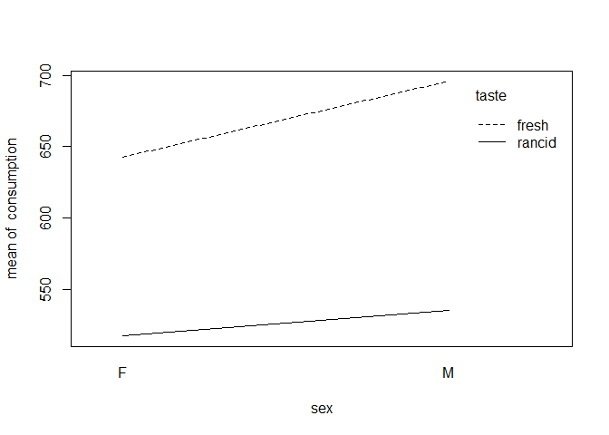<!-- -->

Results: mean consumption appears slightly higher in male subjects than
females. And this observation is the same for both rancid and fresh
lards. So there seems to be no interaction going on. That is, preference
for fresh or rancid is not dependent on sex. If there was an
interaction, the two lines might cross. For example, males might consume
higher .amounts of fresh lard than females, but females consume higher
amounts of rancid lard than males)

Model a 2-way ANOVA:

``` r
results3 <- lm(consumption ~ sex*taste) #NB: The IVs are combined using multiplication (unlike addition in a basic 2-way ANOVA) since factorial ANOVA is interested in interaction.
anova(results3)
```

    ## Analysis of Variance Table
    ## 
    ## Response: consumption
    ##           Df Sum Sq Mean Sq F value    Pr(>F)    
    ## sex        1   3781    3781  2.5925 0.1460358    
    ## taste      1  61204   61204 41.9685 0.0001925 ***
    ## sex:taste  1    919     919  0.6300 0.4502546    
    ## Residuals  8  11667    1458                      
    ## ---
    ## Signif. codes:  0 '***' 0.001 '**' 0.01 '*' 0.05 '.' 0.1 ' ' 1

Results: as previously shown in the interaction plot, this ANOVA model
shows no evidence of interaction between sex and taste (p=0.4503).
However, taste alone has a significant effect on the outcome (mean
consumption), p=0.0002. Sex has no significant influence (p=0.1460)

## Model Assumptions

``` r
par(mfrow = c(1,2))
plot(results3, which = 1) # test for homogeneity of variance
plot(results3, which = 2) # a Q-Q plot for normality test
```

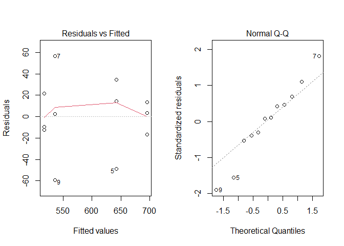<!-- -->

Results: there appears to be no significant violation of the two GLM
assumptions

Some theoretical questions:  
**1.** Would the outcome be different if we changed the order in which
the IVs were entered into the model (i.e., taste before sex instead of
sex before taste)?  
\>– *Answer*: Since the sample is orthogonally distributed between the
two IVs (i.e., the male and female subjects are equally distributed
between taste type \[3 males and 3 females in each of rancid and fresh
conditions\] - another indication of no interaction), the model results
would be the same even after reordering.

**2**. How about using a Type III Sum of Squares approach?  
\>– *Answer*: Again, the design is completely orthogonal and the results
suggest no evidence of interaction. So, the Type III method would yield
same results as Type I above.

However, if there is a need to run a Type III SS ANOVA, the procedure is
as follows:

``` r
library(car) # load the car library
options(contrasts = c(unordered="contr.sum", ordered="contr.poly")) # set the options like this
Anova(results) # run Type III ANOVA
```

    ## Anova Table (Type II tests)
    ## 
    ## Response: weight
    ##               Sum Sq Df F value   Pr(>F)   
    ## genotype   0.0097172  2  6.9682 0.027259 * 
    ## experiment 0.0213910  3 10.2264 0.008967 **
    ## Residuals  0.0041835  6                    
    ## ---
    ## Signif. codes:  0 '***' 0.001 '**' 0.01 '*' 0.05 '.' 0.1 ' ' 1

Results: As mentioned previously, the results are the same as in Type I
SS since there is orthogonality and no evidence of interaction

## ——————————————————————————–

------------------------------------------------------------------------

# **Analysis of Covariance (ANCOVA)**

The ANCOVA is a GLM like the linear regression and ANOVA. However,
whereas the two have one type of predictor (linear reg–continuous;
ANOVA–categorical), ANCOVA has both continuous and categorical
predictors. In summary: ANCOVA = continuous response with categorical
and continuous predictor(s)

## Practice

``` r
leprosyCSV <- read.csv("G:/My Drive/Programming/Data Science/DATA SETS/leprosyCSV.csv")
lep <- leprosyCSV
View(lep)
head(lep)
```

    ##   treatmt bacbef bacafter
    ## 1       1  7.464    7.789
    ## 2       1  8.551    0.000
    ## 3       1 10.774    4.742
    ## 4       1  8.543    3.385
    ## 5       1 16.116   15.082
    ## 6       1 15.486   11.993

``` r
dim(lep)
```

    ## [1] 200   3

The data has 30 rows of actual observations and 170 rows of missing
observations. Remove them:

``` r
lep <- na.omit(lep) 
dim(lep)
```

    ## [1] 30  3

All missing observations now removed.

Visualize the data:

``` r
plot(lep$bacbef, lep$bacafter, pch = c(15:17)[lep$treatmt],
     col = c("red", "blue", "black")[lep$treatmt], xlab = "Bacillus score before",
     ylab = "Bacillus score after")
legend("topleft", pch = c(15:17), legend = c("treat 1", "treat 2", "treat 3"),
       col = c("red", "blue", "black"))
```

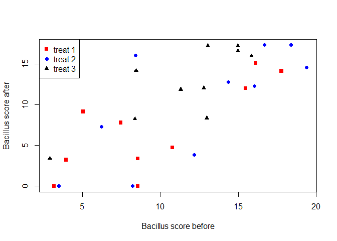<!-- -->

Fit a linear model to the data:

``` r
model1 <- lm(bacafter ~ bacbef+factor(treatmt), data = lep)
```

Run the anova:

``` r
anova(model1)
```

    ## Analysis of Variance Table
    ## 
    ## Response: bacafter
    ##                 Df Sum Sq Mean Sq F value    Pr(>F)    
    ## bacbef           1 587.48  587.48 40.1800 1.033e-06 ***
    ## factor(treatmt)  2  83.35   41.67  2.8502     0.076 .  
    ## Residuals       26 380.15   14.62                      
    ## ---
    ## Signif. codes:  0 '***' 0.001 '**' 0.01 '*' 0.05 '.' 0.1 ' ' 1

Results: bacbef has a significant effect on bacafter but treatmt has no
significant effect (NB: the first IV in the model is controlled for
according to this ‘default’ Type I ANOVA method. That IV here bacbef.)

Check the coefficient:

``` r
model1$coeff
```

    ##      (Intercept)           bacbef factor(treatmt)1 factor(treatmt)2 
    ##      -0.01258299       0.88307024      -1.59003654      -0.72588838

NB: level 1 of treatmt is missing because it is subsumed within the
coefficient for the intercept.

Fit regression lines to the coefficient values:

``` r
plot(lep$bacbef, lep$bacafter, pch = c(15:17)[lep$treatmt],
     col = c("red", "blue", "black")[lep$treatmt], xlab = "Bacillus score before",
     ylab = "Bacillus score after")
legend("topleft", pch = c(15:17), legend = c("treat 1", "treat 2", "treat 3"),
       col = c("red", "blue", "black"))
abline(coef = c(model1$coeff[1], model1$coeff[2]), col = "red") # treatment 1 equation line
abline(coef = c(model1$coeff[1]+model1$coeff[3], model1$coeff[2]), col = "blue") # treatment 2 equation line
abline(coef = c(model1$coeff[1]+model1$coeff[4], model1$coeff[2]), col = "black") # treatment 3 equation line
```

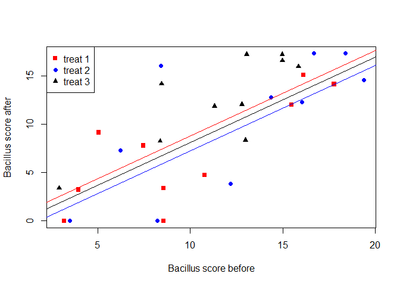<!-- -->

Run the ANOVA using the Type III sum of squares method (see the section
on Multiple Regression)

``` r
library(car)
Anova(model1, type = "III")
```

    ## Anova Table (Type III tests)
    ## 
    ## Response: bacafter
    ##                 Sum Sq Df F value    Pr(>F)    
    ## (Intercept)       0.00  1  0.0000    0.9945    
    ## bacbef          515.01  1 35.2238 2.912e-06 ***
    ## factor(treatmt)  83.35  2  2.8502    0.0760 .  
    ## Residuals       380.15 26                      
    ## ---
    ## Signif. codes:  0 '***' 0.001 '**' 0.01 '*' 0.05 '.' 0.1 ' ' 1

Results: bacbef has a significant effect on bacafter while controlling
for treatment. But treatment has no significant effect while controlling
for bacbef. \[Recall that according to the Type III approach, when
interpreting the effect of one IV, all other IVs in the model are held
constant/controlled for\]

## Evaluate the GLM assumptions

``` r
par(mfrow = c(1,2))
plot(model1, which = 1) # Assumption 1: Homogeneity of variance
plot(model1, which = 2) # Assumption 2: Normality
```

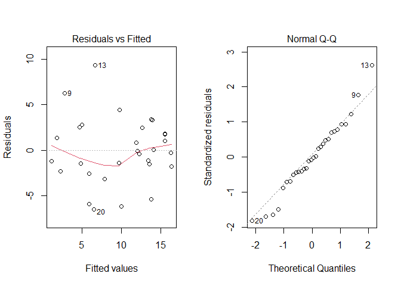<!-- -->

Results:  
\>– Assumption 1 holds (the residuals are relatively homogenuous)  
\>– Assumption 2 holds (the residuals tend to follow a normal
distribution as seen in the Q-Q plot which is approximately a straight
line)

## Parallel vs Non-Parallel Slopes

ANCOVA assumes approximately the same gradient for the different levels
of the categorical var (see the ***parallel slopes*** produced from the
regression lines earlier).

However, it is possible to have a situation where the levels of the
categorical var do have different gradient (***non-parallel slopes***).
Such a case could be modeled by, for example, assuming an interaction
effects between predictors:

``` r
model2 <- lm(bacafter ~ bacbef*factor(treatmt), data = lep)
anova(model2)
```

    ## Analysis of Variance Table
    ## 
    ## Response: bacafter
    ##                        Df Sum Sq Mean Sq F value    Pr(>F)    
    ## bacbef                  1 587.48  587.48 37.2115 2.665e-06 ***
    ## factor(treatmt)         2  83.35   41.67  2.6396    0.0920 .  
    ## bacbef:factor(treatmt)  2   1.25    0.62  0.0396    0.9613    
    ## Residuals              24 378.90   15.79                      
    ## ---
    ## Signif. codes:  0 '***' 0.001 '**' 0.01 '*' 0.05 '.' 0.1 ' ' 1

Results:  
\>– The interaction effect is non-significant, i.e., there is no
evidence to reject the NH that the gradients of those relationships do
not differ between the different levels of the treatmt var (i.e., no
interaction between treatment and bacbef).  
\>– There is also no evidence to reject the NH that treatmt has no
effect on bacafter score (NB: this is a type I sum of square so we are
controlling for bacbef) \>– Finally, there is a significant effect of
bacbef on bacafter.

### Try the type III sum of squares approach

``` r
Anova(model2, type = "III") # NB: the 'car' library has been loaded in a previous command
```

    ## Anova Table (Type III tests)
    ## 
    ## Response: bacafter
    ##                        Sum Sq Df F value    Pr(>F)    
    ## (Intercept)              0.07  1  0.0042    0.9492    
    ## bacbef                 482.63  1 30.5702 1.096e-05 ***
    ## factor(treatmt)          5.83  2  0.1845    0.8327    
    ## bacbef:factor(treatmt)   1.25  2  0.0396    0.9613    
    ## Residuals              378.90 24                      
    ## ---
    ## Signif. codes:  0 '***' 0.001 '**' 0.01 '*' 0.05 '.' 0.1 ' ' 1

Again, only bacbef has a significant effect. And there still is no
evidence of interaction between the two IVs.

``` r
model2$coeff
```

    ##             (Intercept)                  bacbef        factor(treatmt)1 
    ##             -0.12594730              0.88940420             -0.94626719 
    ##        factor(treatmt)2 bacbef:factor(treatmt)1 bacbef:factor(treatmt)2 
    ##             -0.89615575             -0.06108432              0.01666009

### Plotting the slopes

Fit regression lines to the coefficients:

``` r
# par(mfrow = c(1,1)) # this line of code is not required in an R Markdown, since plot definitions are chunk-restricted (i.e., definition/restrictions in one chunk do not carry on to subsequent ones)
plot(lep$bacbef,lep$bacafter, pch = c(15:17)[lep$treatmt],
     col =  c("red","blue","black")[lep$treatmt],
     xlab = "Bacillus score before", ylab = "Bacilus score after")
legend( "topleft", legend = c("treat 1", "treat 2", "treat 3"), 
        pch = c(15:17),col =  c("red","blue","black")) 
abline(coef = c(model2$coeff[1], model2$coeff[2]), col = "red") # treatment 1 equation line
abline(coef = c(model2$coeff[1]+model2$coeff[3], model2$coeff[2]+model2$coeff[5]),
       col = "blue") # treatment 2 equation line
abline(coef = c(model2$coeff[1]+model2$coeff[4], model2$coeff[2]+model2$coeff[6]),
       col = "black") # treatment 3 equation line
```

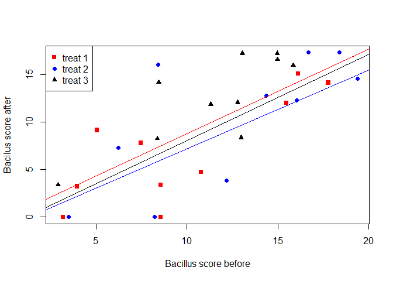<!-- -->

As can be seen in the graph, the slopes are no longer parallel. For
example, the equation lines for treatments 1 and 2 would cross at a
point beyond the y-axis.

## ——————————————————————————–

------------------------------------------------------------------------

# **Chi-Squared Test (Goodness of Fit)**

## Example 1

``` r
obs <- matrix(c(40,53,43,143,199,146), byrow = F, ncol = 2)
colnames(obs) <- c("win", "no win") # win a prize or not
rownames(obs) <- c(2011:2013) # game year
obs
```

    ##      win no win
    ## 2011  40    143
    ## 2012  53    199
    ## 2013  43    146

Example Question: “is there an association between winning/not winning
status and year?” or “Does the probability of winning vary by year?”

This question can be answered using a Chi-Squared test of independence:

``` r
chisq.test(obs, correct = F)
```

    ## 
    ##  Pearson's Chi-squared test
    ## 
    ## data:  obs
    ## X-squared = 0.18796, df = 2, p-value = 0.9103

``` r
#The 'correct=FALSE' option turns off Yates' correction (which is used with small sample sizes).
```

Do not reject the NH that there is no association between winning and
year (i.e., there is no evidence of an association between winning and
year).

We can go ahead and combine our data over all those years:

``` r
obsfreq <- c(136,488) #136 wins and 488 losses
```

Assume there is a population with 1/6 probability of winning a prize
(vs. 5/6 of not winning). Can we reject the NH that the data above
derives from this population?

``` r
results <- chisq.test(obsfreq, p = c(1/6,5/6))
results
```

    ## 
    ##  Chi-squared test for given probabilities
    ## 
    ## data:  obsfreq
    ## X-squared = 11.815, df = 1, p-value = 0.0005874

We can reject the NH that the data derives from that population (i.e.,
there is no evidence to suggest that the data derives from the
population).

In what way does the data deviate from said population?

``` r
results$expected
```

    ## [1] 104 520

As seen, we would expect 104 wins and 520 losses if the data were from
the population having a 1/6 winning chance. However, the current data
has significantly more wins and fewer losses (136 and 488, respectively)
than would be expected.

## Example 2

``` r
observedfreq <- c(31,87,47,173,18,77)
observed <- matrix(observedfreq, byrow = T, ncol = 2)
rownames(observed)<- c("small", "medium", "large") # cup sizes
colnames(observed) <- c("win", "loss") # outcomes
observed
```

    ##        win loss
    ## small   31   87
    ## medium  47  173
    ## large   18   77

Question: Is there an association between outcome and cup size?

``` r
chisq.test(observed, correct = F)
```

    ## 
    ##  Pearson's Chi-squared test
    ## 
    ## data:  observed
    ## X-squared = 1.8049, df = 2, p-value = 0.4056

Results: No evidence to reject the NH that the outcome is independent of
cup size

How/what is the deviation (i.e., what would we expect in order to reject
the NH)?

``` r
chisq.test(observed)$expected
```

    ##             win      loss
    ## small  26.16166  91.83834
    ## medium 48.77598 171.22402
    ## large  21.06236  73.93764

The results show what the distribution would look like if we would
reject the NH.

A Similar question as above but with a smaller sample size

``` r
freq <- c(5,13,3,15,3,15,4,34)
ofreq <- matrix(freq, byrow = T, ncol = 2)
rownames(ofreq)<- c("extra large", "large", "medium", "small") # cup sizes
colnames(ofreq) <- c("win", "loss") # outcomes
ofreq
```

    ##             win loss
    ## extra large   5   13
    ## large         3   15
    ## medium        3   15
    ## small         4   34

``` r
result <- chisq.test(ofreq, correct = T) #Note that the Yate's correction is now set to true, due to the small sample size.
```

    ## Warning in chisq.test(ofreq, correct = T): Chi-squared approximation may be
    ## incorrect

``` r
result
```

    ## 
    ##  Pearson's Chi-squared test
    ## 
    ## data:  ofreq
    ## X-squared = 2.6696, df = 3, p-value = 0.4454

The warning message arises due to the small sample size Same results as
the previous data: No solid evidence to reject the NH hypothesis that
the outcome is independent of the cup size.

``` r
result$expected
```

    ##                  win     loss
    ## extra large 2.934783 15.06522
    ## large       2.934783 15.06522
    ## medium      2.934783 15.06522
    ## small       6.195652 31.80435

Due to the relatively low sample size in some cells, the validity of the
test may be questioned. One way to address this is by conducting the
Fisher’s exact test.

``` r
fisher.test(ofreq)
```

    ## 
    ##  Fisher's Exact Test for Count Data
    ## 
    ## data:  ofreq
    ## p-value = 0.4484
    ## alternative hypothesis: two.sided

The Fisher’s test answers the question, “Considering the observed
frequencies, what is the probability of obtaining that outcome or a more
extreme one if the NH of there being no association was true?” The
response to this question (as seen in the output above) is about 45%
(i.e., p=0.4484).

In summary: again, there is no evidence of a relationship between
outcome and cup size. So we cannot reject the NH.
